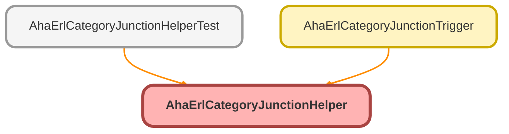

---
hide:
  - path
---

# AhaErlCategoryJunctionHelper Class

Trigger helper for AHA_ERL_Category_Junction__c. Assigns a unique 
ExternalIdentifier__c to newly inserted junction records that do not yet have one.

## Class Diagram



<!-- Apex description -->

## Apex Code

```java
/**
 * @description Trigger helper for AHA_ERL_Category_Junction__c. Assigns a unique
 * ExternalIdentifier__c to newly inserted junction records that do not yet have one.
 */
public with sharing class AhaErlCategoryJunctionHelper {
    /**
     * @description Sets ExternalIdentifier__c on junctions in the given Id set that are
     * currently null, using the format 'AHAERLCJ-{Id}'.
     * @param junctionids Ids of the newly inserted AHA_ERL_Category_Junction__c records
     */
    public static void updateExternalIdentifier(Set<Id> junctionids) {
        List<AHA_ERL_Category_Junction__c> junctionsToUpdate = [SELECT Id, ExternalIdentifier__c FROM AHA_ERL_Category_Junction__c WHERE Id IN :junctionids AND ExternalIdentifier__c = null];
        if (!junctionsToUpdate.isEmpty()) {
            for (AHA_ERL_Category_Junction__c junction : junctionsToUpdate) {
                junction.ExternalIdentifier__c = 'AHAERLCJ-' + junction.Id;
            }
            update junctionsToUpdate;
        }
    }
}
```

## Methods
### `updateExternalIdentifier(junctionids)`

Sets ExternalIdentifier__c on junctions in the given Id set that are 
currently null, using the format &#x27;AHAERLCJ-{Id}&#x27;.

#### Signature
```apex
public static void updateExternalIdentifier(Set<Id> junctionids)
```

#### Parameters
| Name | Type | Description |
|------|------|-------------|
| junctionids | Set<Id> | Ids of the newly inserted AHA_ERL_Category_Junction__c records |

#### Return Type
**void**