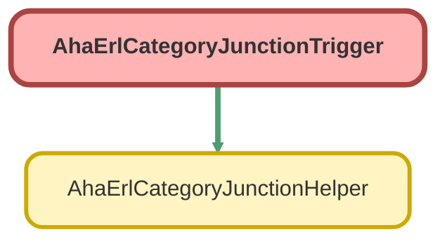

---
hide:
  - path
---

# AhaErlCategoryJunctionTrigger Trigger

## Class Diagram



<!-- Apex description -->

## Apex Code

```java
trigger AhaErlCategoryJunctionTrigger on AHA_ERL_Category_Junction__c (after insert) {
    AhaErlCategoryJunctionHelper.updateExternalIdentifier(Trigger.newMap.keySet());
}
```

## Trigger On AHA_ERL_Category_Junction__c

**Run**
* After Insert