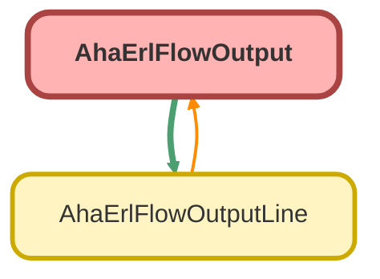

---
hide:
  - path
---

# AhaErlFlowOutput Class

## Class Diagram



<!-- Apex description -->

## Apex Code

```java
global class AhaErlFlowOutput {
    @AuraEnabled public String userId { get; set; }
    @AuraEnabled public String userName { get; set; }
    @AuraEnabled public String timestamp { get; set; }
    @AuraEnabled public List<AhaErlFlowOutputLine> repairSorLines { get; set; }
}

```

## Properties
### `userId`

`AURAENABLED`

#### Signature
```apex
public userId
```

#### Type
String

---

### `userName`

`AURAENABLED`

#### Signature
```apex
public userName
```

#### Type
String

---

### `timestamp`

`AURAENABLED`

#### Signature
```apex
public timestamp
```

#### Type
String

---

### `repairSorLines`

`AURAENABLED`

#### Signature
```apex
public repairSorLines
```

#### Type
List<AhaErlFlowOutputLine>