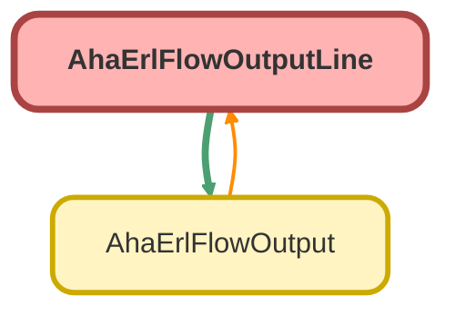

---
hide:
  - path
---

# AhaErlFlowOutputLine Class

## Class Diagram



<!-- Apex description -->

## Apex Code

```java
global class AhaErlFlowOutputLine {
    @AuraEnabled public String outputReference { get; set; }
    @AuraEnabled public String sorUnit { get; set; }
    @AuraEnabled public String sorTrade { get; set; }
    @AuraEnabled public String sorCode { get; set; }
    @AuraEnabled public String sorSubject { get; set; }
    @AuraEnabled public String sorDescription { get; set; }
    @AuraEnabled public String sorQuantity { get; set; }
    @AuraEnabled public String sorPriority { get; set; }
    @AuraEnabled public String sorJobTitle { get; set; }
    @AuraEnabled public String sorHeading { get; set; }
    @AuraEnabled public String sorComment { get; set; }
    @AuraEnabled public String sorRate { get; set; }
    @AuraEnabled public String repairLocation { get; set; }
}

```

## Properties
### `outputReference`

`AURAENABLED`

#### Signature
```apex
public outputReference
```

#### Type
String

---

### `sorUnit`

`AURAENABLED`

#### Signature
```apex
public sorUnit
```

#### Type
String

---

### `sorTrade`

`AURAENABLED`

#### Signature
```apex
public sorTrade
```

#### Type
String

---

### `sorCode`

`AURAENABLED`

#### Signature
```apex
public sorCode
```

#### Type
String

---

### `sorSubject`

`AURAENABLED`

#### Signature
```apex
public sorSubject
```

#### Type
String

---

### `sorDescription`

`AURAENABLED`

#### Signature
```apex
public sorDescription
```

#### Type
String

---

### `sorQuantity`

`AURAENABLED`

#### Signature
```apex
public sorQuantity
```

#### Type
String

---

### `sorPriority`

`AURAENABLED`

#### Signature
```apex
public sorPriority
```

#### Type
String

---

### `sorJobTitle`

`AURAENABLED`

#### Signature
```apex
public sorJobTitle
```

#### Type
String

---

### `sorHeading`

`AURAENABLED`

#### Signature
```apex
public sorHeading
```

#### Type
String

---

### `sorComment`

`AURAENABLED`

#### Signature
```apex
public sorComment
```

#### Type
String

---

### `sorRate`

`AURAENABLED`

#### Signature
```apex
public sorRate
```

#### Type
String

---

### `repairLocation`

`AURAENABLED`

#### Signature
```apex
public repairLocation
```

#### Type
String