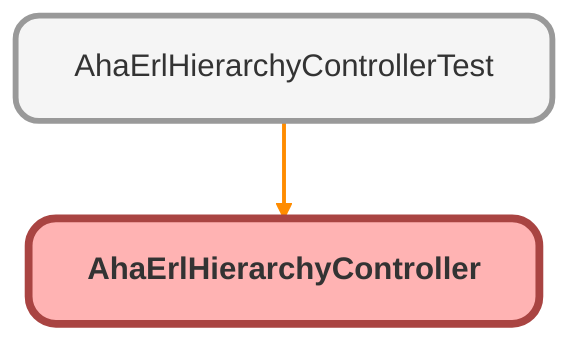

---
hide:
  - path
---

# AhaErlHierarchyController Class

LWC controller for the hierarchy viewer, providing read-only access to the full 
SOR hierarchy with category path breadcrumbs and profile-scoped accessibility information.

## Class Diagram



<!-- Apex description -->

## Apex Code

```java
/**
 * @description LWC controller for the hierarchy viewer, providing read-only access to the full
 * SOR hierarchy with category path breadcrumbs and profile-scoped accessibility information.
 */
public with sharing class AhaErlHierarchyController {

    /**
     * @description DTO representing one SOR-to-category row in the hierarchy table, including
     * the full root-to-leaf category path and whether every ancestor is accessible for the profile.
     */
    public class SORHierarchyData {
        @AuraEnabled
        public String sorId;
        @AuraEnabled
        public String sorCode;
        @AuraEnabled
        public String sorHeadingText;
        @AuraEnabled
        public String categoryPath;
        @AuraEnabled
        public String categoryId;
        @AuraEnabled
        public Boolean isAccessible;
    }
    
    /**
     * @description Returns all SOR-to-category rows accessible to the given profile, each with
     * a root-to-leaf category path and an accessibility flag. RepairLocationCloseup nodes can be
     * suppressed from paths via includeCloseups.
     * @param profileName Name of the AHA_ERL_Code_Profile__c to scope results to
     * @param includeCloseups When false, closeup category labels are omitted from the path string
     * @return List of SORHierarchyData rows, one per SOR-category junction
     */
    @AuraEnabled(cacheable=true)
    public static List<SORHierarchyData> getSORHierarchyData(String profileName, Boolean includeCloseups) {
        // Get the profile ID
        Id profileId = getProfileId(profileName);
        if (profileId == null) {
            return new List<SORHierarchyData>();
        }
        
        // Get all accessible categories for this profile
        Set<Id> accessibleCategoryIds = getAccessibleCategories(profileId);
        
        // Build category hierarchy map
        Map<Id, AHA_ERL_Category__c> allCategories = new Map<Id, AHA_ERL_Category__c>(
            [SELECT Id, Label__c, ParentCategoryLookup__c, RecordType.DeveloperName
             FROM AHA_ERL_Category__c]
        );
        
        // Get all SOR to Category junctions
        List<AHA_ERL_Category_Junction__c> sorCategoryJunctions = [
            SELECT AHA_ERL_Code__c, 
                   AHA_ERL_Category__c,
                   AHA_ERL_Code__r.SORCodeText__c,
                   AHA_ERL_Code__r.SORHeadingText__c
            FROM AHA_ERL_Category_Junction__c
            WHERE AHA_ERL_Code__r.RecordType.DeveloperName != 'Message'
            ORDER BY AHA_ERL_Code__r.SORCodeText__c, AHA_ERL_Category__c
        ];
        
        // Get all SORs that are assigned to this profile
        Set<Id> profileSORIds = new Set<Id>();
        for (AHA_ERL_Junction__c junction : [
            SELECT SORCode__c 
            FROM AHA_ERL_Junction__c 
            WHERE SORProfile__c = :profileId 
              AND SORCode__c != null
        ]) {
            profileSORIds.add(junction.SORCode__c);
        }
        
        List<SORHierarchyData> results = new List<SORHierarchyData>();
        
        // Process each SOR-Category junction as a separate row
        for (AHA_ERL_Category_Junction__c junction : sorCategoryJunctions) {
            // Skip if SOR not assigned to profile
            if (!profileSORIds.contains(junction.AHA_ERL_Code__c)) {
                continue;
            }
            
            SORHierarchyData data = new SORHierarchyData();
            data.sorId = junction.AHA_ERL_Code__c;
            data.sorCode = junction.AHA_ERL_Code__r.SORCodeText__c;
            data.sorHeadingText = junction.AHA_ERL_Code__r.SORHeadingText__c;
            data.categoryId = junction.AHA_ERL_Category__c;
            
            // Build category path
            data.categoryPath = buildCategoryPath(junction.AHA_ERL_Category__c, allCategories, includeCloseups);
            
            // Check if the entire path is accessible
            data.isAccessible = isCategoryPathAccessible(
                junction.AHA_ERL_Category__c, 
                allCategories, 
                accessibleCategoryIds
            );
            
            results.add(data);
        }
        
        return results;
    }
    
    /**
     * @description Returns all repair profiles as label/value map pairs, ordered by name,
     * for use in the hierarchy viewer profile combobox.
     * @return List of maps, each containing 'label' and 'value' keys set to the profile name
     */
    @AuraEnabled(cacheable=true)
    public static List<Map<String, String>> getProfileOptions() {
        List<Map<String, String>> options = new List<Map<String, String>>();
        
        for (AHA_ERL_Code_Profile__c profile : [
            SELECT Id, Name, Description__c 
            FROM AHA_ERL_Code_Profile__c 
            ORDER BY Name ASC
        ]) {
            Map<String, String> option = new Map<String, String>();
            option.put('label', profile.Name);
            option.put('value', profile.Name);
            options.add(option);
        }
        
        return options;
    }
    
    private static Id getProfileId(String profileName) {
        List<AHA_ERL_Code_Profile__c> profiles = [
            SELECT Id 
            FROM AHA_ERL_Code_Profile__c 
            WHERE Name = :profileName 
            LIMIT 1
        ];
        
        return profiles.isEmpty() ? null : profiles[0].Id;
    }
    
    private static Set<Id> getAccessibleCategories(Id profileId) {
        Set<Id> accessibleIds = new Set<Id>();
        
        for (AHA_ERL_Junction__c junction : [
            SELECT SORCategory__c 
            FROM AHA_ERL_Junction__c 
            WHERE SORProfile__c = :profileId 
              AND SORCategory__c != null
        ]) {
            accessibleIds.add(junction.SORCategory__c);
        }
        
        return accessibleIds;
    }
    
    /**
     * @description Walks from a leaf category up to the root via ParentCategoryLookup__c, building
     * a ' > ' separated breadcrumb string. Guards against cycles with a visited set and caps depth at 20.
     * @param categoryId Leaf category Id to start from
     * @param allCategories Pre-queried map of all categories keyed by Id
     * @param includeCloseups When false, RepairLocationCloseup nodes are excluded from the path
     * @return Breadcrumb string e.g. "Root > Parent > Leaf", or 'Unknown' if unresolvable
     */
    private static String buildCategoryPath(Id categoryId, Map<Id, AHA_ERL_Category__c> allCategories, Boolean includeCloseups) {
        if (categoryId == null || allCategories == null || allCategories.isEmpty()) {
            return 'Unknown';
        }
        
        List<String> pathParts = new List<String>();
        Id currentId = categoryId;
        Set<Id> visited = new Set<Id>(); // Prevent infinite loops
        Integer maxDepth = 20; // Safety limit
        Integer depth = 0;
        
        while (currentId != null && !visited.contains(currentId) && depth < maxDepth) {
            visited.add(currentId);
            depth++;
            
            if (!allCategories.containsKey(currentId)) {
                break;
            }
            
            AHA_ERL_Category__c category = allCategories.get(currentId);
            
            if (category == null) {
                break;
            }
            
            // Skip closeups if includeCloseups is false
            Boolean isCloseup = category.RecordType.DeveloperName == 'RepairLocationCloseup';
            
            if (String.isNotBlank(category.Label__c) && (includeCloseups || !isCloseup)) {
                pathParts.add(category.Label__c); // Add to end, we'll reverse later
            }
            currentId = category.ParentCategoryLookup__c;
        }
        
        if (pathParts.isEmpty()) {
            return 'Unknown';
        }
        
        // Reverse the list to get root-to-leaf order
        List<String> reversedPath = new List<String>();
        for (Integer i = pathParts.size() - 1; i >= 0; i--) {
            reversedPath.add(pathParts.get(i));
        }
        
        String result = '';
        for (Integer i = 0; i < reversedPath.size(); i++) {
            if (i > 0) {
                result += ' > ';
            }
            result += reversedPath.get(i);
        }
        
        return result;
    }
    
    /**
     * @description Returns true only if every category from the given leaf up to the root is
     * present in the profile's accessible category set. A single inaccessible ancestor makes
     * the whole path inaccessible.
     * @param categoryId Leaf category Id to check
     * @param allCategories Pre-queried map of all categories keyed by Id
     * @param accessibleCategoryIds Set of category Ids assigned to the current profile
     * @return Boolean true if the full ancestor chain is accessible
     */
    private static Boolean isCategoryPathAccessible(
        Id categoryId, 
        Map<Id, AHA_ERL_Category__c> allCategories,
        Set<Id> accessibleCategoryIds
    ) {
        Id currentId = categoryId;
        Set<Id> visited = new Set<Id>(); // Prevent infinite loops
        
        // Check each level from current category up to root
        while (currentId != null && !visited.contains(currentId)) {
            visited.add(currentId);
            
            // If any category in the path is not accessible, return false
            if (!accessibleCategoryIds.contains(currentId)) {
                return false;
            }
            
            AHA_ERL_Category__c category = allCategories.get(currentId);
            if (category == null) {
                break;
            }
            
            currentId = category.ParentCategoryLookup__c;
        }
        
        return true;
    }
}
```

## Methods
### `getSORHierarchyData(profileName, includeCloseups)`

`AURAENABLED`

Returns all SOR-to-category rows accessible to the given profile, each with 
a root-to-leaf category path and an accessibility flag. RepairLocationCloseup nodes can be 
suppressed from paths via includeCloseups.

#### Signature
```apex
public static List<SORHierarchyData> getSORHierarchyData(String profileName, Boolean includeCloseups)
```

#### Parameters
| Name | Type | Description |
|------|------|-------------|
| profileName | String | Name of the AHA_ERL_Code_Profile__c to scope results to |
| includeCloseups | Boolean | When false, closeup category labels are omitted from the path string |

#### Return Type
**List<SORHierarchyData>**

List of SORHierarchyData rows, one per SOR-category junction

---

### `getProfileOptions()`

`AURAENABLED`

Returns all repair profiles as label/value map pairs, ordered by name, 
for use in the hierarchy viewer profile combobox.

#### Signature
```apex
public static List<Map<String,String>> getProfileOptions()
```

#### Return Type
**List<Map<String,String>>**

List of maps, each containing &#x27;label&#x27; and &#x27;value&#x27; keys set to the profile name

---

### `getProfileId(profileName)`

#### Signature
```apex
private static Id getProfileId(String profileName)
```

#### Parameters
| Name | Type | Description |
|------|------|-------------|
| profileName | String |  |

#### Return Type
**Id**

---

### `getAccessibleCategories(profileId)`

#### Signature
```apex
private static Set<Id> getAccessibleCategories(Id profileId)
```

#### Parameters
| Name | Type | Description |
|------|------|-------------|
| profileId | Id |  |

#### Return Type
**Set<Id>**

---

### `buildCategoryPath(categoryId, allCategories, includeCloseups)`

Walks from a leaf category up to the root via ParentCategoryLookup__c, building 
a &#x27; &gt; &#x27; separated breadcrumb string. Guards against cycles with a visited set and caps depth at 20.

#### Signature
```apex
private static String buildCategoryPath(Id categoryId, Map<Id,AHA_ERL_Category__c> allCategories, Boolean includeCloseups)
```

#### Parameters
| Name | Type | Description |
|------|------|-------------|
| categoryId | Id | Leaf category Id to start from |
| allCategories | Map<Id,AHA_ERL_Category__c> | Pre-queried map of all categories keyed by Id |
| includeCloseups | Boolean | When false, RepairLocationCloseup nodes are excluded from the path |

#### Return Type
**String**

Breadcrumb string e.g. &quot;Root &gt; Parent &gt; Leaf&quot;, or &#x27;Unknown&#x27; if unresolvable

---

### `isCategoryPathAccessible(categoryId, allCategories, accessibleCategoryIds)`

Returns true only if every category from the given leaf up to the root is 
present in the profile&#x27;s accessible category set. A single inaccessible ancestor makes 
the whole path inaccessible.

#### Signature
```apex
private static Boolean isCategoryPathAccessible(Id categoryId, Map<Id,AHA_ERL_Category__c> allCategories, Set<Id> accessibleCategoryIds)
```

#### Parameters
| Name | Type | Description |
|------|------|-------------|
| categoryId | Id | Leaf category Id to check |
| allCategories | Map<Id,AHA_ERL_Category__c> | Pre-queried map of all categories keyed by Id |
| accessibleCategoryIds | Set<Id> | Set of category Ids assigned to the current profile |

#### Return Type
**Boolean**

Boolean true if the full ancestor chain is accessible

## Classes
### SORHierarchyData Class

DTO representing one SOR-to-category row in the hierarchy table, including 
the full root-to-leaf category path and whether every ancestor is accessible for the profile.

#### Fields
##### `sorId`

`AURAENABLED`

###### Signature
```apex
public sorId
```

###### Type
String

---

##### `sorCode`

`AURAENABLED`

###### Signature
```apex
public sorCode
```

###### Type
String

---

##### `sorHeadingText`

`AURAENABLED`

###### Signature
```apex
public sorHeadingText
```

###### Type
String

---

##### `categoryPath`

`AURAENABLED`

###### Signature
```apex
public categoryPath
```

###### Type
String

---

##### `categoryId`

`AURAENABLED`

###### Signature
```apex
public categoryId
```

###### Type
String

---

##### `isAccessible`

`AURAENABLED`

###### Signature
```apex
public isAccessible
```

###### Type
Boolean