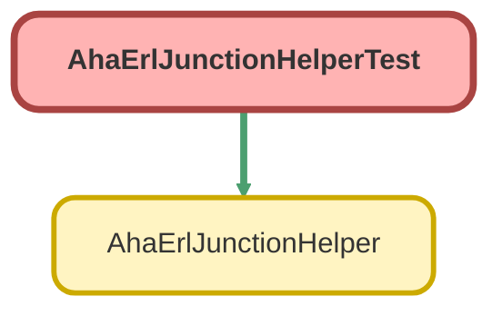

---
hide:
  - path
---

# AhaErlJunctionHelperTest Class

`ISTEST`

## Class Diagram



<!-- Apex description -->

## Apex Code

```java
@IsTest
private class AhaErlJunctionHelperTest {

    @TestSetup
    static void setup() {
        AHA_ERL_Code_Profile__c profile = new AHA_ERL_Code_Profile__c(
            Name = 'Test Profile',
            ExternalIdentifier__c = 'SETUP-PROF-001'
        );
        insert profile;
    }

    @IsTest
    static void insertSetsExternalIdentifier() {
        AHA_ERL_Code_Profile__c profile = [SELECT Id FROM AHA_ERL_Code_Profile__c LIMIT 1];

        AHA_ERL_Junction__c junction = new AHA_ERL_Junction__c(
            SORProfile__c = profile.Id
        );

        Test.startTest();
        insert junction;
        Test.stopTest();

        AHA_ERL_Junction__c result = [
            SELECT ExternalIdentifier__c FROM AHA_ERL_Junction__c WHERE Id = :junction.Id
        ];
        System.assert(
            result.ExternalIdentifier__c != null,
            'ExternalIdentifier__c should be set after insert'
        );
        System.assert(
            result.ExternalIdentifier__c.startsWith('AHAERLJ-'),
            'ExternalIdentifier__c should start with AHAERLJ-'
        );
        System.assert(
            result.ExternalIdentifier__c.contains(junction.Id),
            'ExternalIdentifier__c should include the record Id'
        );
    }

    @IsTest
    static void doesNotOverwriteExistingExternalIdentifier() {
        AHA_ERL_Code_Profile__c profile = [SELECT Id FROM AHA_ERL_Code_Profile__c LIMIT 1];

        AHA_ERL_Junction__c junction = new AHA_ERL_Junction__c(
            SORProfile__c = profile.Id,
            ExternalIdentifier__c = 'PRE-EXISTING-VALUE'
        );
        insert junction;

        Test.startTest();
        AhaErlJunctionHelper.updateExternalIdentifier(new Set<Id>{ junction.Id });
        Test.stopTest();

        AHA_ERL_Junction__c result = [
            SELECT ExternalIdentifier__c FROM AHA_ERL_Junction__c WHERE Id = :junction.Id
        ];
        System.assertEquals(
            'PRE-EXISTING-VALUE',
            result.ExternalIdentifier__c,
            'Should not overwrite an already-set ExternalIdentifier__c'
        );
    }
}
```

## Methods
### `setup()`

`TESTSETUP`

#### Signature
```apex
private static void setup()
```

#### Return Type
**void**

---

### `insertSetsExternalIdentifier()`

`ISTEST`

#### Signature
```apex
private static void insertSetsExternalIdentifier()
```

#### Return Type
**void**

---

### `doesNotOverwriteExistingExternalIdentifier()`

`ISTEST`

#### Signature
```apex
private static void doesNotOverwriteExistingExternalIdentifier()
```

#### Return Type
**void**