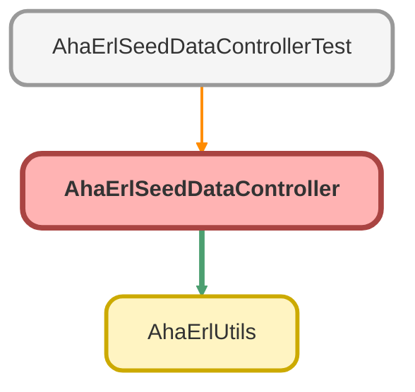

---
hide:
  - path
---

# AhaErlSeedDataController Class

Provides first-run seed data generation for ERL. Exposes an isEmpty check so the 
LWC can conditionally show a &quot;Generate example data&quot; button, and a generateSeedData method that 
builds a complete demonstration hierarchy in a single transaction.

## Class Diagram



<!-- Apex description -->

## Apex Code

```java
/**
 * @description Provides first-run seed data generation for ERL. Exposes an isEmpty check so the
 * LWC can conditionally show a "Generate example data" button, and a generateSeedData method that
 * builds a complete demonstration hierarchy in a single transaction.
 */
public with sharing class AhaErlSeedDataController {

    /**
     * @description Returns true when no AHA_ERL_Category__c records exist in the org, used to
     * determine whether the seed data button should be shown to the admin.
     * @return Boolean true if the org has no category records
     */
    @AuraEnabled
    public static Boolean isEmpty() {
        return [SELECT COUNT() FROM AHA_ERL_Category__c] == 0;
    }

    /**
     * @description Generates a demonstration category hierarchy with example SOR codes, building
     * the full Plumbing and Doors & Windows tree including closeups, buttons, item lists, problems,
        * and SOR codes for both diagnostic and guided scenarios. Also ensures Default, Default Guided,
        * and ALL profiles exist. No-ops if any categories already exist.
     * @return Success message string or an 'error: ...' string on failure or pre-condition violation
     */
    @AuraEnabled
    public static String generateSeedData() {
        if (!isEmpty()) {
            return 'error: ERL data already exists. Seed data was not created.';
        }
        if (!AhaErlUtils.hasErlAdministrationPermission()) {
            return 'error: You do not have permission to generate seed data.';
        }
        try {
            Map<String, Id> catRT = new Map<String, Id>();
            for (RecordType rt : [SELECT Id, DeveloperName FROM RecordType WHERE SobjectType = 'AHA_ERL_Category__c']) {
                catRT.put(rt.DeveloperName, rt.Id);
            }
            Id sorCodeRTId = [SELECT Id FROM RecordType WHERE SobjectType = 'AHA_ERL_Code__c' AND DeveloperName = 'SORCode' LIMIT 1].Id;

            // ── Profiles ─────────────────────────────────────────────────────────────
            AHA_ERL_Code_Profile__c defaultProfile = ensureProfile('Default', 'Default repair profile', false);
            AHA_ERL_Code_Profile__c defaultGuidedProfile = ensureProfile('Default Guided', 'Default guided repair profile', true);
            AHA_ERL_Code_Profile__c allProfile = ensureProfile('ALL', 'Admin: Displays every element', false);

            // ── Categories (diagnostic + guided) ────────────────────────────────────
            SeedScenario diagnosticScenario = createCategoryScenario(catRT, false);
            SeedScenario guidedScenario = createCategoryScenario(catRT, true);

            // ── SOR codes ─────────────────────────────────────────────────────────────
            List<AHA_ERL_Code__c> sorCodes = new List<AHA_ERL_Code__c>{
                makeSOR('PL001', 'Replace bath tap washer', 'Replace the faulty washer on the bath tap to stop the drip.', 'Plumbing', sorCodeRTId),
                makeSOR('PL002', 'Replace bath tap', 'Remove and replace the bath tap unit in full.', 'Plumbing', sorCodeRTId),
                makeSOR('PL003', 'Replace basin tap washer', 'Replace the faulty washer on the basin tap to stop the drip.', 'Plumbing', sorCodeRTId),
                makeSOR('PL004', 'Replace basin tap', 'Remove and replace the basin tap unit in full.', 'Plumbing', sorCodeRTId),
                makeSOR('DW001', 'Adjust internal door', 'Adjust hinges or latch so the internal door closes correctly.', 'Joinery', sorCodeRTId),
                makeSOR('DW002', 'Replace internal door', 'Remove and replace the internal door leaf.', 'Joinery', sorCodeRTId),
                makeSOR('DW003', 'Adjust external door lock', 'Adjust the lock mechanism on the external door.', 'Joinery', sorCodeRTId),
                makeSOR('DW004', 'Replace external door lock', 'Remove and replace the external door lock.', 'Joinery', sorCodeRTId)
            };
            upsert sorCodes;

            Map<String, Id> sorById = new Map<String, Id>();
            for (AHA_ERL_Code__c s : sorCodes) {
                sorById.put(s.SORCodeText__c, s.Id);
            }

            // ── Category-to-SOR junctions ─────────────────────────────────────────────
            List<AHA_ERL_Category_Junction__c> catJunctions = new List<AHA_ERL_Category_Junction__c>{
                new AHA_ERL_Category_Junction__c(AHA_ERL_Category__c = diagnosticScenario.problemCategoryIds.get('drippingBath'), AHA_ERL_Code__c = sorById.get('PL001')),
                new AHA_ERL_Category_Junction__c(AHA_ERL_Category__c = diagnosticScenario.problemCategoryIds.get('drippingBath'), AHA_ERL_Code__c = sorById.get('PL002')),
                new AHA_ERL_Category_Junction__c(AHA_ERL_Category__c = diagnosticScenario.problemCategoryIds.get('drippingBasin'), AHA_ERL_Code__c = sorById.get('PL003')),
                new AHA_ERL_Category_Junction__c(AHA_ERL_Category__c = diagnosticScenario.problemCategoryIds.get('drippingBasin'), AHA_ERL_Code__c = sorById.get('PL004')),
                new AHA_ERL_Category_Junction__c(AHA_ERL_Category__c = diagnosticScenario.problemCategoryIds.get('doorNotClosing'), AHA_ERL_Code__c = sorById.get('DW001')),
                new AHA_ERL_Category_Junction__c(AHA_ERL_Category__c = diagnosticScenario.problemCategoryIds.get('doorNotClosing'), AHA_ERL_Code__c = sorById.get('DW002')),
                new AHA_ERL_Category_Junction__c(AHA_ERL_Category__c = diagnosticScenario.problemCategoryIds.get('doorNotLocking'), AHA_ERL_Code__c = sorById.get('DW003')),
                new AHA_ERL_Category_Junction__c(AHA_ERL_Category__c = diagnosticScenario.problemCategoryIds.get('doorNotLocking'), AHA_ERL_Code__c = sorById.get('DW004')),
                new AHA_ERL_Category_Junction__c(AHA_ERL_Category__c = guidedScenario.problemCategoryIds.get('drippingBath'), AHA_ERL_Code__c = sorById.get('PL001')),
                new AHA_ERL_Category_Junction__c(AHA_ERL_Category__c = guidedScenario.problemCategoryIds.get('drippingBath'), AHA_ERL_Code__c = sorById.get('PL002')),
                new AHA_ERL_Category_Junction__c(AHA_ERL_Category__c = guidedScenario.problemCategoryIds.get('drippingBasin'), AHA_ERL_Code__c = sorById.get('PL003')),
                new AHA_ERL_Category_Junction__c(AHA_ERL_Category__c = guidedScenario.problemCategoryIds.get('drippingBasin'), AHA_ERL_Code__c = sorById.get('PL004')),
                new AHA_ERL_Category_Junction__c(AHA_ERL_Category__c = guidedScenario.problemCategoryIds.get('doorNotClosing'), AHA_ERL_Code__c = sorById.get('DW001')),
                new AHA_ERL_Category_Junction__c(AHA_ERL_Category__c = guidedScenario.problemCategoryIds.get('doorNotClosing'), AHA_ERL_Code__c = sorById.get('DW002')),
                new AHA_ERL_Category_Junction__c(AHA_ERL_Category__c = guidedScenario.problemCategoryIds.get('doorNotLocking'), AHA_ERL_Code__c = sorById.get('DW003')),
                new AHA_ERL_Category_Junction__c(AHA_ERL_Category__c = guidedScenario.problemCategoryIds.get('doorNotLocking'), AHA_ERL_Code__c = sorById.get('DW004'))
            };
            upsert catJunctions;

            // ── Profile junctions ─────────────────────────────────────────────────────
            List<AHA_ERL_Junction__c> profileJunctions = new List<AHA_ERL_Junction__c>();
            for (AHA_ERL_Category__c cat : diagnosticScenario.categories) {
                profileJunctions.add(new AHA_ERL_Junction__c(SORCategory__c = cat.Id, SORProfile__c = defaultProfile.Id));
                profileJunctions.add(new AHA_ERL_Junction__c(SORCategory__c = cat.Id, SORProfile__c = allProfile.Id));
            }
            for (AHA_ERL_Category__c cat : guidedScenario.categories) {
                profileJunctions.add(new AHA_ERL_Junction__c(SORCategory__c = cat.Id, SORProfile__c = defaultGuidedProfile.Id));
                profileJunctions.add(new AHA_ERL_Junction__c(SORCategory__c = cat.Id, SORProfile__c = allProfile.Id));
            }
            for (AHA_ERL_Code__c sor : sorCodes) {
                profileJunctions.add(new AHA_ERL_Junction__c(SORCode__c = sor.Id, SORProfile__c = defaultProfile.Id));
                profileJunctions.add(new AHA_ERL_Junction__c(SORCode__c = sor.Id, SORProfile__c = defaultGuidedProfile.Id));
                profileJunctions.add(new AHA_ERL_Junction__c(SORCode__c = sor.Id, SORProfile__c = allProfile.Id));
            }
            upsert profileJunctions;

        } catch (Exception e) {
            return 'error: ' + e.getMessage() + ' line ' + e.getLineNumber();
        }
        return 'Example data generated successfully.';
    }

    // ── Private helpers ───────────────────────────────────────────────────────────

    private static AHA_ERL_Code_Profile__c ensureProfile(String name, String description, Boolean isGuided) {
        List<AHA_ERL_Code_Profile__c> existing = [SELECT Id, Guided__c, Description__c FROM AHA_ERL_Code_Profile__c WHERE Name = :name LIMIT 1];
        if (!existing.isEmpty()) {
            AHA_ERL_Code_Profile__c existingProfile = existing[0];
            Boolean needsUpdate = existingProfile.Guided__c != isGuided || existingProfile.Description__c != description;
            if (needsUpdate) {
                existingProfile.Guided__c = isGuided;
                existingProfile.Description__c = description;
                upsert existingProfile;
            }
            return existingProfile;
        }
        AHA_ERL_Code_Profile__c p = new AHA_ERL_Code_Profile__c(
            Name = name,
            ExternalIdentifier__c = name,
            Description__c = description,
            Guided__c = isGuided
        );
        upsert p;
        return p;
    }

    private static AHA_ERL_Category__c makeCat(String label, String imageFileText, Id recordTypeId, Id parentId, Boolean isGuided) {
        String parentSuffix = parentId != null ? '-' + String.valueOf(parentId).right(8) : '-ROOT';
        String modeSuffix = isGuided ? '-GUIDED' : '-DIAG';
        return new AHA_ERL_Category__c(
            Label__c = label,
            EditModeLabel__c = label,
            ImageFileText__c = imageFileText,
            RecordTypeId = recordTypeId,
            ParentCategoryLookup__c = parentId,
            Guided__c = isGuided,
            ExternalIdentifier__c = 'SEED-' + label.replaceAll('[^A-Za-z0-9]', '-').toUpperCase() + parentSuffix + modeSuffix
        );
    }

    private static AHA_ERL_Category__c makeBtn(String label, Id recordTypeId, Id parentId, String left, String top, Boolean isGuided) {
        AHA_ERL_Category__c btn = makeCat(label, 'PLACEHOLDER.jpg', recordTypeId, parentId, isGuided);
        btn.Layout_Left__c = left;
        btn.Layout_Top__c = top;
        return btn;
    }

    private class SeedScenario {
        List<AHA_ERL_Category__c> categories;
        Map<String, Id> problemCategoryIds;

        SeedScenario(List<AHA_ERL_Category__c> categories, Map<String, Id> problemCategoryIds) {
            this.categories = categories;
            this.problemCategoryIds = problemCategoryIds;
        }
    }

    private static SeedScenario createCategoryScenario(Map<String, Id> catRT, Boolean isGuided) {
        // ── Root categories ───────────────────────────────────────────────────────
        AHA_ERL_Category__c plumbing = makeCat('Plumbing', 'PLUMBING.jpg', catRT.get('RepairCategory'), null, isGuided);
        AHA_ERL_Category__c doorsWindows = makeCat('Doors & Windows', 'DOORSANDWINDOWS.jpg', catRT.get('RepairCategory'), null, isGuided);
        upsert new List<AHA_ERL_Category__c>{ plumbing, doorsWindows };

        // ── Plumbing subcat ─────────────────────────────────────────────────────
        AHA_ERL_Category__c baths = makeCat('Baths', 'PLUMBING\\BATHTUBS.jpg', catRT.get('RepairCategory'), plumbing.Id, isGuided);
        AHA_ERL_Category__c basins = makeCat('Basins', 'PLUMBING\\BASINS.jpg', catRT.get('RepairCategory'), plumbing.Id, isGuided);
        upsert new List<AHA_ERL_Category__c>{ baths, basins };

        // ── Plumbing closeups ─────────────────────────────────────────────────────
        AHA_ERL_Category__c bathsc = makeCat('Baths', 'PLUMBING\\BATHTUBS_CLOSEUP.jpg', catRT.get('RepairLocationCloseup'), baths.Id, isGuided);
        AHA_ERL_Category__c basinsc = makeCat('Basins', 'PLUMBING\\BASINS_CLOSEUP.jpg', catRT.get('RepairLocationCloseup'), basins.Id, isGuided);
        upsert new List<AHA_ERL_Category__c>{ bathsc, basinsc };

        // ── Doors & Windows subcat ──────────────────────────────────────────────
        AHA_ERL_Category__c internalDoors = makeCat('Internal Doors', 'DOORSANDWINDOWS\\INTERNALDOORS.jpg', catRT.get('RepairCategory'), doorsWindows.Id, isGuided);
        AHA_ERL_Category__c externalDoors = makeCat('External Doors', 'DOORSANDWINDOWS\\EXTERNALDOORS.jpg', catRT.get('RepairCategory'), doorsWindows.Id, isGuided);
        upsert new List<AHA_ERL_Category__c>{ internalDoors, externalDoors };

        // ── Doors & Windows closeups ──────────────────────────────────────────────
        AHA_ERL_Category__c internalDoorsCloseup = makeCat('Internal Doors closeup', 'DOORSANDWINDOWS\\INTERNALDOORS_CLOSEUP.jpg', catRT.get('RepairLocationCloseup'), internalDoors.Id, isGuided);
        AHA_ERL_Category__c externalDoorsCloseup = makeCat('External Doors closeup', 'DOORSANDWINDOWS\\EXTERNALDOORS_CLOSEUP.jpg', catRT.get('RepairLocationCloseup'), externalDoors.Id, isGuided);
        upsert new List<AHA_ERL_Category__c>{ internalDoorsCloseup, externalDoorsCloseup };

        // ── Buttons ───────────────────────────────────────────────────────────────
        AHA_ERL_Category__c bathTapBtn = makeBtn('Bath Tap', catRT.get('RepairLocationButton'), bathsc.Id, '30%', '40%', isGuided);
        AHA_ERL_Category__c basinTapBtn = makeBtn('Basin Tap', catRT.get('RepairLocationButton'), basinsc.Id, '50%', '30%', isGuided);
        AHA_ERL_Category__c intDoorBtn = makeBtn('Door Frame', catRT.get('RepairLocationButton'), internalDoorsCloseup.Id, '45%', '50%', isGuided);
        AHA_ERL_Category__c extDoorBtn = makeBtn('Front Door', catRT.get('RepairLocationButton'), externalDoorsCloseup.Id, '45%', '50%', isGuided);
        upsert new List<AHA_ERL_Category__c>{ bathTapBtn, basinTapBtn, intDoorBtn, extDoorBtn };

        // ── Item lists ────────────────────────────────────────────────────────────
        AHA_ERL_Category__c bathTapList = makeCat('Bath Tap Issues', 'PLACEHOLDER.jpg', catRT.get('ItemList'), bathTapBtn.Id, isGuided);
        AHA_ERL_Category__c basinTapList = makeCat('Basin Tap Issues', 'PLACEHOLDER.jpg', catRT.get('ItemList'), basinTapBtn.Id, isGuided);
        AHA_ERL_Category__c intDoorList = makeCat('Internal Door Issues', 'PLACEHOLDER.jpg', catRT.get('ItemList'), intDoorBtn.Id, isGuided);
        AHA_ERL_Category__c extDoorList = makeCat('External Door Issues', 'PLACEHOLDER.jpg', catRT.get('ItemList'), extDoorBtn.Id, isGuided);
        upsert new List<AHA_ERL_Category__c>{ bathTapList, basinTapList, intDoorList, extDoorList };

        // ── Problems ──────────────────────────────────────────────────────────────
        AHA_ERL_Category__c drippingBath = makeCat('Dripping Bath Tap', 'PLACEHOLDER.jpg', catRT.get('SOR_Item_Layout'), bathTapList.Id, isGuided);
        AHA_ERL_Category__c drippingBasin = makeCat('Dripping Basin Tap', 'PLACEHOLDER.jpg', catRT.get('SOR_Item_Layout'), basinTapList.Id, isGuided);
        AHA_ERL_Category__c doorNotClosing = makeCat('Door Not Closing', 'PLACEHOLDER.jpg', catRT.get('SOR_Item_Layout'), intDoorList.Id, isGuided);
        AHA_ERL_Category__c doorNotLocking = makeCat('Door Not Locking', 'PLACEHOLDER.jpg', catRT.get('SOR_Item_Layout'), extDoorList.Id, isGuided);
        upsert new List<AHA_ERL_Category__c>{ drippingBath, drippingBasin, doorNotClosing, doorNotLocking };

        List<AHA_ERL_Category__c> allCats = new List<AHA_ERL_Category__c>{
            plumbing, doorsWindows,
            baths, basins, internalDoors, externalDoors,
            bathsc, basinsc, internalDoorsCloseup, externalDoorsCloseup,
            bathTapBtn, basinTapBtn, intDoorBtn, extDoorBtn,
            bathTapList, basinTapList, intDoorList, extDoorList,
            drippingBath, drippingBasin, doorNotClosing, doorNotLocking
        };

        return new SeedScenario(
            allCats,
            new Map<String, Id>{
                'drippingBath' => drippingBath.Id,
                'drippingBasin' => drippingBasin.Id,
                'doorNotClosing' => doorNotClosing.Id,
                'doorNotLocking' => doorNotLocking.Id
            }
        );
    }

    private static AHA_ERL_Code__c makeSOR(String code, String heading, String description, String trade, Id recordTypeId) {
        return new AHA_ERL_Code__c(
            SORCodeText__c = code,
            SORHeadingText__c = heading,
            SORDescriptionText__c = heading,
            SORFullDescriptionLongText__c = description,
            Trade__c = trade,
            DefaultLocation__c = 'UNK',
            DefaultPriority__c = 'Routine',
            DefaultQuantity__c = 1,
            RecordTypeId = recordTypeId
        );
    }
}
```

## Methods
### `isEmpty()`

`AURAENABLED`

Returns true when no AHA_ERL_Category__c records exist in the org, used to 
determine whether the seed data button should be shown to the admin.

#### Signature
```apex
public static Boolean isEmpty()
```

#### Return Type
**Boolean**

Boolean true if the org has no category records

---

### `generateSeedData()`

`AURAENABLED`

Generates a demonstration category hierarchy with example SOR codes, building 
the full Plumbing and Doors &amp; Windows tree including closeups, buttons, item lists, problems, 
and SOR codes for both diagnostic and guided scenarios. Also ensures Default, Default Guided, 
and ALL profiles exist. No-ops if any categories already exist.

#### Signature
```apex
public static String generateSeedData()
```

#### Return Type
**String**

Success message string or an &#x27;error: ...&#x27; string on failure or pre-condition violation

---

### `ensureProfile(name, description, isGuided)`

#### Signature
```apex
private static AHA_ERL_Code_Profile__c ensureProfile(String name, String description, Boolean isGuided)
```

#### Parameters
| Name | Type | Description |
|------|------|-------------|
| name | String |  |
| description | String |  |
| isGuided | Boolean |  |

#### Return Type
**[AHA_ERL_Code_Profile__c](../objects/AHA_ERL_Code_Profile__c.md)**

---

### `makeCat(label, imageFileText, recordTypeId, parentId, isGuided)`

#### Signature
```apex
private static AHA_ERL_Category__c makeCat(String label, String imageFileText, Id recordTypeId, Id parentId, Boolean isGuided)
```

#### Parameters
| Name | Type | Description |
|------|------|-------------|
| label | String |  |
| imageFileText | String |  |
| recordTypeId | Id |  |
| parentId | Id |  |
| isGuided | Boolean |  |

#### Return Type
**[AHA_ERL_Category__c](../objects/AHA_ERL_Category__c.md)**

---

### `makeBtn(label, recordTypeId, parentId, left, top, isGuided)`

#### Signature
```apex
private static AHA_ERL_Category__c makeBtn(String label, Id recordTypeId, Id parentId, String left, String top, Boolean isGuided)
```

#### Parameters
| Name | Type | Description |
|------|------|-------------|
| label | String |  |
| recordTypeId | Id |  |
| parentId | Id |  |
| left | String |  |
| top | String |  |
| isGuided | Boolean |  |

#### Return Type
**[AHA_ERL_Category__c](../objects/AHA_ERL_Category__c.md)**

---

### `createCategoryScenario(catRT, isGuided)`

#### Signature
```apex
private static SeedScenario createCategoryScenario(Map<String,Id> catRT, Boolean isGuided)
```

#### Parameters
| Name | Type | Description |
|------|------|-------------|
| catRT | Map<String,Id> |  |
| isGuided | Boolean |  |

#### Return Type
**SeedScenario**

---

### `makeSOR(code, heading, description, trade, recordTypeId)`

#### Signature
```apex
private static AHA_ERL_Code__c makeSOR(String code, String heading, String description, String trade, Id recordTypeId)
```

#### Parameters
| Name | Type | Description |
|------|------|-------------|
| code | String |  |
| heading | String |  |
| description | String |  |
| trade | String |  |
| recordTypeId | Id |  |

#### Return Type
**[AHA_ERL_Code__c](../objects/AHA_ERL_Code__c.md)**

## Classes
### SeedScenario Class

#### Fields
##### `categories`

###### Signature
```apex
private categories
```

###### Type
List<AHA_ERL_Category__c>

---

##### `problemCategoryIds`

###### Signature
```apex
private problemCategoryIds
```

###### Type
Map<String,Id>

#### Constructors
##### `SeedScenario(categories, problemCategoryIds)`

###### Signature
```apex
private SeedScenario(List<AHA_ERL_Category__c> categories, Map<String,Id> problemCategoryIds)
```

###### Parameters
| Name | Type | Description |
|------|------|-------------|
| categories | List<AHA_ERL_Category__c> |  |
| problemCategoryIds | Map<String,Id> |  |