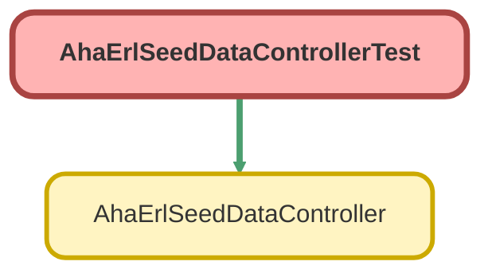

---
hide:
  - path
---

# AhaErlSeedDataControllerTest Class

`ISTEST`

Unit tests for AhaErlSeedDataController covering the isEmpty check, 
successful seed generation, idempotency guard, and basic record structure.

## Class Diagram



<!-- Apex description -->

## Apex Code

```java
/**
 * @description Unit tests for AhaErlSeedDataController covering the isEmpty check,
 * successful seed generation, idempotency guard, and basic record structure.
 */
@IsTest
private class AhaErlSeedDataControllerTest {

    @IsTest
    static void isEmptyReturnsTrueWhenNoCategoriesExist() {
        Test.startTest();
        Boolean result = AhaErlSeedDataController.isEmpty();
        Test.stopTest();
        System.assertEquals(true, result, 'isEmpty should return true when no categories exist');
    }

    @IsTest
    static void isEmptyReturnsFalseWhenCategoriesExist() {
        Id rtId = Schema.SObjectType.AHA_ERL_Category__c.getRecordTypeInfosByDeveloperName()
            .get('RepairCategory').getRecordTypeId();
        insert new AHA_ERL_Category__c(
            Label__c = 'Test',
            EditModeLabel__c = 'Test',
            ExternalIdentifier__c = 'TEST-CAT',
            RecordTypeId = rtId
        );

        Test.startTest();
        Boolean result = AhaErlSeedDataController.isEmpty();
        Test.stopTest();
        System.assertEquals(false, result, 'isEmpty should return false when categories exist');
    }

    @IsTest
    static void generateSeedDataCreatesExpectedRecords() {
        Test.startTest();
        String result = AhaErlSeedDataController.generateSeedData();
        Test.stopTest();

        System.assert(!result.startsWith('error'), 'generateSeedData should succeed: ' + result);

        // 44 categories total (22 diagnostic + 22 guided)
        System.assertEquals(44, [SELECT COUNT() FROM AHA_ERL_Category__c], 'Should create 44 categories');
        System.assertEquals(22, [SELECT COUNT() FROM AHA_ERL_Category__c WHERE Guided__c = true], 'Should create 22 guided categories');
        System.assertEquals(22, [SELECT COUNT() FROM AHA_ERL_Category__c WHERE Guided__c = false], 'Should create 22 diagnostic categories');
        System.assertEquals(8, [SELECT COUNT() FROM AHA_ERL_Code__c], 'Should create 8 SOR codes');

        // Profile junctions: 44 cats × 2 profiles + 8 SORs × 3 profiles = 112
        System.assertEquals(112, [SELECT COUNT() FROM AHA_ERL_Junction__c], 'Should create 112 profile junctions');

        // Category-to-SOR junctions: 2 per problem, 4 problems, 2 modes = 16
        System.assertEquals(16, [SELECT COUNT() FROM AHA_ERL_Category_Junction__c], 'Should create 16 category-SOR junctions');

        // Profiles should exist
        System.assertEquals(1, [SELECT COUNT() FROM AHA_ERL_Code_Profile__c WHERE Name = 'Default'], 'Default profile should exist');
        System.assertEquals(1, [SELECT COUNT() FROM AHA_ERL_Code_Profile__c WHERE Name = 'Default Guided' AND Guided__c = true], 'Default Guided profile should exist and be guided');
        System.assertEquals(1, [SELECT COUNT() FROM AHA_ERL_Code_Profile__c WHERE Name = 'ALL'], 'ALL profile should exist');

        // Root categories should exist in both modes
        System.assertEquals(2, [SELECT COUNT() FROM AHA_ERL_Category__c WHERE ParentCategoryLookup__c = null AND Guided__c = false], 'Should have 2 diagnostic root categories');
        System.assertEquals(2, [SELECT COUNT() FROM AHA_ERL_Category__c WHERE ParentCategoryLookup__c = null AND Guided__c = true], 'Should have 2 guided root categories');
    }

    @IsTest
    static void generateSeedDataIsIdempotentGuard() {
        // First call should succeed
        AhaErlSeedDataController.generateSeedData();

        Test.startTest();
        // Second call should return an error, not duplicate data
        String result = AhaErlSeedDataController.generateSeedData();
        Test.stopTest();

        System.assert(result.startsWith('error'), 'Second call should return an error: ' + result);
        System.assertEquals(44, [SELECT COUNT() FROM AHA_ERL_Category__c], 'Should still only have 44 categories after second call');
    }
}
```

## Methods
### `isEmptyReturnsTrueWhenNoCategoriesExist()`

`ISTEST`

#### Signature
```apex
private static void isEmptyReturnsTrueWhenNoCategoriesExist()
```

#### Return Type
**void**

---

### `isEmptyReturnsFalseWhenCategoriesExist()`

`ISTEST`

#### Signature
```apex
private static void isEmptyReturnsFalseWhenCategoriesExist()
```

#### Return Type
**void**

---

### `generateSeedDataCreatesExpectedRecords()`

`ISTEST`

#### Signature
```apex
private static void generateSeedDataCreatesExpectedRecords()
```

#### Return Type
**void**

---

### `generateSeedDataIsIdempotentGuard()`

`ISTEST`

#### Signature
```apex
private static void generateSeedDataIsIdempotentGuard()
```

#### Return Type
**void**