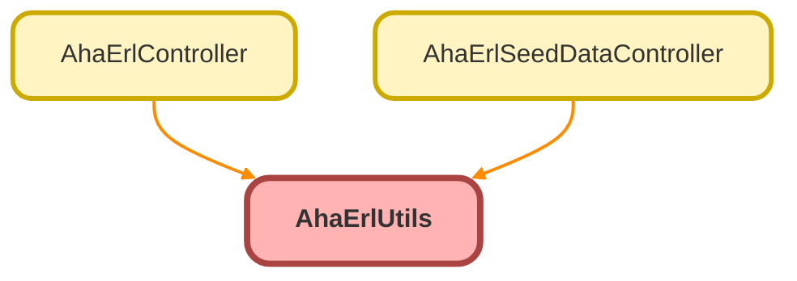

---
hide:
  - path
---

# AhaErlUtils Class

Shared utility methods used across the ERL Apex layer.

## Class Diagram



<!-- Apex description -->

## Apex Code

```java
/**
 * @description Shared utility methods used across the ERL Apex layer.
 */
public with sharing class AhaErlUtils {

    /**
     * @description Returns true if the running org is a sandbox, detected via the org domain URL.
     * Compatible with Experience Cloud guest and customer user contexts.
     * @return Boolean true if sandbox, false if production
     */
    @AuraEnabled
    public static Boolean isSandbox() {
        //customer user compatible
        string testURL = system.URL.getOrgDomainUrl().toString();
        return testURL.contains('.sandbox.') || testURL.contains('.scratch.');
    }

    /**
     * @description Returns true if the running user has the ERL Administration custom permission.
     * Used as an authorisation guard before any write operation in the ERL controllers.
     * @return Boolean true if the current user has ERL Administration permission
     */
    public static Boolean hasErlAdministrationPermission() {
        return FeatureManagement.checkPermission('ERL_Administration');
    }

}
```

## Methods
### `isSandbox()`

`AURAENABLED`

Returns true if the running org is a sandbox, detected via the org domain URL. 
Compatible with Experience Cloud guest and customer user contexts.

#### Signature
```apex
public static Boolean isSandbox()
```

#### Return Type
**Boolean**

Boolean true if sandbox, false if production

---

### `hasErlAdministrationPermission()`

Returns true if the running user has the ERL Administration custom permission. 
Used as an authorisation guard before any write operation in the ERL controllers.

#### Signature
```apex
public static Boolean hasErlAdministrationPermission()
```

#### Return Type
**Boolean**

Boolean true if the current user has ERL Administration permission