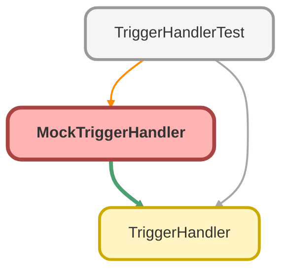

---
hide:
  - path
---

# MockTriggerHandler Class

a mock trigger handler

**Inheritance**

[TriggerHandler](TriggerHandler.md)

## Class Diagram



<!-- Apex description -->

## Apex Code

```java
/**
 * @description a mock trigger handler
 */
public with sharing class MockTriggerHandler extends TriggerHandler {

	//Used when testing mock to ensure correct methods are called.
	public String triggerContextCalled;
	
	public MockTriggerHandler(){
		//optionally set max recursion default is null (no max recursion defined).
		//this.setMaxRecursion(2);
	}

	/**
	* @description implementation for the before insert trigger context method.
	**/
	public override void beforeInsert() {
		super.beforeInsert(); //Not needed but calls TriggerHandler defaults.
		this.triggerContextCalled = 'beforeInsert';
	}

	/**
	* @description implementation for the before update trigger context method.
	**/
	public override void beforeUpdate() {
		super.beforeUpdate(); //Not needed but calls TriggerHandler defaults.
		this.triggerContextCalled = 'beforeUpdate';
	}

	/**
	* @description implementation for the before delete trigger context method.
	**/
	public override void beforeDelete() {
		super.beforeDelete(); //Not needed but calls TriggerHandler defaults.
		this.triggerContextCalled = 'beforeDelete';
	}

	/**
	* @description implementation for the after insert trigger context method.
	**/
	public override void afterInsert() {
		super.afterInsert(); //Not needed but calls TriggerHandler defaults.
		this.triggerContextCalled = 'afterInsert';
	}

	/**
	* @description implementation for the after update trigger context method.
	**/
	public override void afterUpdate() {
		super.afterUpdate(); //Not needed but calls TriggerHandler defaults.
		this.triggerContextCalled = 'afterUpdate';
	}

	/**
	* @description implementation for the after delete trigger context method.
	**/
	public override void afterDelete() {
		super.afterDelete(); //Not needed but calls TriggerHandler defaults.
		this.triggerContextCalled = 'afterDelete';
	}

	/**
	* @description implementation for the after undelete trigger context method.
	**/
	public override void afterUndelete() {
		super.afterUndelete(); //Not needed but calls TriggerHandler defaults.
		this.triggerContextCalled = 'afterUndelete';
	}

}
```

## Fields
### `triggerContextCalled`

#### Signature
```apex
public triggerContextCalled
```

#### Type
String

## Constructors
### `MockTriggerHandler()`

#### Signature
```apex
public MockTriggerHandler()
```

## Methods
### `beforeInsert()`

implementation for the before insert trigger context method.

#### Signature
```apex
public override void beforeInsert()
```

#### Return Type
**void**

---

### `beforeUpdate()`

implementation for the before update trigger context method.

#### Signature
```apex
public override void beforeUpdate()
```

#### Return Type
**void**

---

### `beforeDelete()`

implementation for the before delete trigger context method.

#### Signature
```apex
public override void beforeDelete()
```

#### Return Type
**void**

---

### `afterInsert()`

implementation for the after insert trigger context method.

#### Signature
```apex
public override void afterInsert()
```

#### Return Type
**void**

---

### `afterUpdate()`

implementation for the after update trigger context method.

#### Signature
```apex
public override void afterUpdate()
```

#### Return Type
**void**

---

### `afterDelete()`

implementation for the after delete trigger context method.

#### Signature
```apex
public override void afterDelete()
```

#### Return Type
**void**

---

### `afterUndelete()`

implementation for the after undelete trigger context method.

#### Signature
```apex
public override void afterUndelete()
```

#### Return Type
**void**

---

### `run()`

*Inherited*

The run method is called to carryout the method for the given trigger context. 
If an override has not being provided on the trigger handler extending this class 
the method will remain blank and therefor no action will be taken.

#### Signature
```apex
public void run()
```

#### Return Type
**void**

---

### `bypass(handlerName)`

*Inherited*

bypass a TriggerHandler given the name of the TriggerHandler class.

#### Signature
```apex
public static void bypass(String handlerName)
```

#### Parameters
| Name | Type | Description |
|------|------|-------------|
| handlerName | String |  |

#### Return Type
**void**

#### Throws
[TriggerHandlerException](TriggerHandlerException.md): - when handlerName is null

[TriggerHandlerException](TriggerHandlerException.md): - when handlerName is empty

[TriggerHandlerException](TriggerHandlerException.md): - when handlerName is not a valid TriggerHandler, is not a,[object Object],		  class that extends TriggerHandler.

---

### `bypass(handlerName, context)`

*Inherited*

bypass a TriggerHandler context given the name of the TriggerHandler class and 
the context for bypass.

#### Signature
```apex
public static void bypass(String handlerName, TriggerContext context)
```

#### Parameters
| Name | Type | Description |
|------|------|-------------|
| handlerName | String |  |
| context | TriggerContext |  |

#### Return Type
**void**

#### Throws
[TriggerHandlerException](TriggerHandlerException.md): - when handlerName is null

[TriggerHandlerException](TriggerHandlerException.md): - when handlerName is empty

[TriggerHandlerException](TriggerHandlerException.md): - when handlerName is not a valid TriggerHandler, is not a,[object Object],		  class that extends TriggerHandler.

---

### `bypass(handlerName, contexts)`

*Inherited*

bypass a TriggerHandler contexts given the name of the TriggerHandler class and 
the contexts for bypass.

#### Signature
```apex
public static void bypass(String handlerName, Set<TriggerContext> contexts)
```

#### Parameters
| Name | Type | Description |
|------|------|-------------|
| handlerName | String |  |
| contexts | Set<TriggerContext> |  |

#### Return Type
**void**

#### Throws
[TriggerHandlerException](TriggerHandlerException.md): - when handlerName is null

[TriggerHandlerException](TriggerHandlerException.md): - when handlerName is empty

[TriggerHandlerException](TriggerHandlerException.md): - when handlerName is not a valid TriggerHandler, is not a,[object Object],		  class that extends TriggerHandler.

---

### `clearBypass(handlerName)`

*Inherited*

clear the bypass of TriggerHandler given the name of the TriggerHandler class for 
all contexts.

#### Signature
```apex
public static void clearBypass(String handlerName)
```

#### Parameters
| Name | Type | Description |
|------|------|-------------|
| handlerName | String |  |

#### Return Type
**void**

#### Throws
[TriggerHandlerException](TriggerHandlerException.md): - when handlerName is null

[TriggerHandlerException](TriggerHandlerException.md): - when handlerName is empty

[TriggerHandlerException](TriggerHandlerException.md): - when handlerName is not a valid TriggerHandler, is not a,[object Object],		  class that extends TriggerHandler.

---

### `clearBypass(handlerName, context)`

*Inherited*

clear the bypass of TriggerHandler given the name of the TriggerHandler class for 
given context.

#### Signature
```apex
public static void clearBypass(String handlerName, TriggerContext context)
```

#### Parameters
| Name | Type | Description |
|------|------|-------------|
| handlerName | String |  |
| context | TriggerContext |  |

#### Return Type
**void**

#### Throws
[TriggerHandlerException](TriggerHandlerException.md): - when handlerName is null

[TriggerHandlerException](TriggerHandlerException.md): - when handlerName is empty

[TriggerHandlerException](TriggerHandlerException.md): - when handlerName is not a valid TriggerHandler, is not a,[object Object],		  class that extends TriggerHandler.

---

### `clearBypass(handlerName, contexts)`

*Inherited*

clear the bypass of TriggerHandler given the name of the TriggerHandler class for 
given contexts.

#### Signature
```apex
public static void clearBypass(String handlerName, Set<TriggerContext> contexts)
```

#### Parameters
| Name | Type | Description |
|------|------|-------------|
| handlerName | String |  |
| contexts | Set<TriggerContext> |  |

#### Return Type
**void**

#### Throws
[TriggerHandlerException](TriggerHandlerException.md): - when handlerName is null

[TriggerHandlerException](TriggerHandlerException.md): - when handlerName is empty

[TriggerHandlerException](TriggerHandlerException.md): - when handlerName is not a valid TriggerHandler, is not a,[object Object],		  class that extends TriggerHandler.

---

### `clearAllBypasses()`

*Inherited*

clear the bypass of all TriggerHandlers for all contexts, so that they are all 
active again.

#### Signature
```apex
public static void clearAllBypasses()
```

#### Return Type
**void**

---

### `isBypassed(handlerName)`

*Inherited*

check is a TriggerHandler is bypassed given the name of the TriggerHandler class.

#### Signature
```apex
public static Boolean isBypassed(String handlerName)
```

#### Parameters
| Name | Type | Description |
|------|------|-------------|
| handlerName | String |  |

#### Return Type
**Boolean**

Boolean - returns true if the handler passed in is bypassed.

#### Throws
[TriggerHandlerException](TriggerHandlerException.md): - when handlerName is null.

[TriggerHandlerException](TriggerHandlerException.md): - when handlerName is empty.

[TriggerHandlerException](TriggerHandlerException.md): - when handlerName is not a valid TriggerHandler, is not a,[object Object],		  class that extends TriggerHandler.

---

### `isBypassed(handlerName, context)`

*Inherited*

check is a TriggerHandler is bypassed given the name of the TriggerHandler class 
and a context to validate, if no context is given, will validate if the whole 
trigger is bypassed.

#### Signature
```apex
public static Boolean isBypassed(String handlerName, TriggerContext context)
```

#### Parameters
| Name | Type | Description |
|------|------|-------------|
| handlerName | String |  |
| context | TriggerContext |  |

#### Return Type
**Boolean**

Boolean - returns true if the handler context passed in is bypassed.

#### Throws
[TriggerHandlerException](TriggerHandlerException.md): - when handlerName is null.

[TriggerHandlerException](TriggerHandlerException.md): - when handlerName is empty.

[TriggerHandlerException](TriggerHandlerException.md): - when handlerName is not a valid TriggerHandler, is not a,[object Object],		  class that extends TriggerHandler.

---

### `isBypassed(handlerName, contexts)`

*Inherited*

check is a TriggerHandler is bypassed given the name of the TriggerHandler class 
and the contexts to validate, if no contexts given will validate if the whole 
trigger is bypassed.

#### Signature
```apex
public static Boolean isBypassed(String handlerName, Set<TriggerContext> contexts)
```

#### Parameters
| Name | Type | Description |
|------|------|-------------|
| handlerName | String |  |
| contexts | Set<TriggerContext> |  |

#### Return Type
**Boolean**

Boolean - returns true if the handler context passed in is bypassed.

#### Throws
[TriggerHandlerException](TriggerHandlerException.md): - when handlerName is null.

[TriggerHandlerException](TriggerHandlerException.md): - when handlerName is empty.

[TriggerHandlerException](TriggerHandlerException.md): - when handlerName is not a valid TriggerHandler, is not a,[object Object],		  class that extends TriggerHandler.