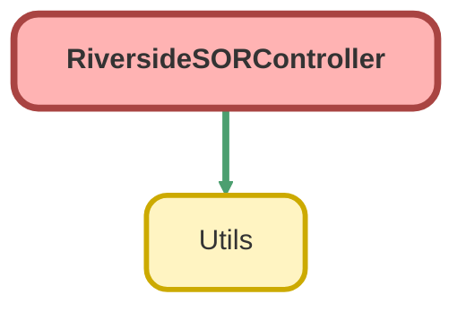

---
hide:
  - path
---

# RiversideSORController Class

## Class Diagram



<!-- Apex description -->

## Apex Code

```java
public with sharing class RiversideSORController {

    public static final String ALL_PROFILE_NAME = 'ALL';

    public class SORResponse {
        @AuraEnabled
        public String id;
        @AuraEnabled
        public Boolean isGuided;
        @AuraEnabled
        public String label;
        @AuraEnabled
        public String editModeLabel;
        @AuraEnabled
        public String imageFileText;
        @AuraEnabled
        public String recordType;
        @AuraEnabled
        public string guidance;
        @AuraEnabled
        public boolean hasGuidance;
        @AuraEnabled
        public List<SORButtons> buttons;

        public SORResponse() {
            hasGuidance = false;
        }
    }

    public class SORButtons {
        @AuraEnabled
        public String id;
        @AuraEnabled
        public Boolean isGuided;
        @AuraEnabled
        public String label;
        @AuraEnabled
        public String editModeLabel;
        @AuraEnabled
        public String layoutLeft;
        @AuraEnabled
        public String layoutTop;
        @AuraEnabled
        public String redirectToCategory;
    }

    public class AvailableSORList {
        @AuraEnabled
        public String id;
        @AuraEnabled
        public String label;
        @AuraEnabled
        public String editModeLabel;
        @AuraEnabled
        public Boolean selected;
        @AuraEnabled
        public List<AvailableSORList> subCategories;
        @AuraEnabled
        public List<AvailableSORs> sorList;
        @AuraEnabled
        public List<Message> messages;

        public AvailableSORList() {
            selected = false;
        }
    }

    public class Message {
        @AuraEnabled
        public String id;
        @AuraEnabled
        public String message;
    }

    public class AvailableSORs {
        @AuraEnabled
        public String id;
        @AuraEnabled
        public String sorCode;
        @AuraEnabled
        public String sorDescription;
        @AuraEnabled
        public Boolean selected;
        @AuraEnabled
        public Integer quantity;
        @AuraEnabled
        public String location;
        @AuraEnabled
        public String priority;
        @AuraEnabled
        public Decimal rate;
        @AuraEnabled
        public String heading;
        @AuraEnabled
        public String fullDescription;
        @AuraEnabled
        public String trade;

        public AvailableSORs() {
            selected = false;
            quantity = 1;
        }
    }

    public class BrowseSORCat {
        @AuraEnabled
        public String category;
        @AuraEnabled
        public List<BrowseSORSubCat> subCategories;

        public BrowseSORCat() {
            category = 'UNDEFINED';
            subCategories = new List<BrowseSORSubCat>();
        }
    }

    public class BrowseSORSubCat {
        @AuraEnabled
        public String subCategory;
        @AuraEnabled
        public List<AvailableSORs> sorList;

        public BrowseSORSubCat() {
            subCategory = 'UNDEFINED';
            sorList = new List<AvailableSORs>();
        }
    }

    @AuraEnabled
    public static Boolean isSandbox() {
        return Utils.isSandbox();
    }

    @AuraEnabled
    public static Boolean updateSORCategoryCoords(Map<String, String> params) {
        try {
            Id recId = params.get('id');
            String x = params.get('x');
            String y = params.get('y');
            Riverside_SOR_Category__c rsc = [SELECT Id, Layout_Left__c, Layout_Top__c 
                                             FROM Riverside_SOR_Category__c 
                                             WHERE Id = :recId];
            rsc.Layout_Left__c = x;
            rsc.Layout_Top__c = y;
            update rsc;
        } catch (exception e) {
            return false;
        }
        return true;
    }

    @AuraEnabled 
    public static List<Riverside_SOR_Code_Profile__c> getAllProfiles() {
        return [SELECT Id, Name, Description__c, Guided__c 
                FROM Riverside_SOR_Code_Profile__c 
                ORDER BY Name ASC];
    }

    @AuraEnabled
    public static List<SORResponse> getSORRootCategories(String profileName){
        List<Riverside_SOR_Category__c> rsc = [SELECT Id, Label__c, EditModeLabel__c, ImageFileText__c, RecordType.DeveloperName, Guided__c 
                                                FROM Riverside_SOR_Category__c 
                                                WHERE Id IN (SELECT SORCategory__c FROM Riverside_SOR_Junction__c WHERE SORProfile__r.Name = :profileName AND SORCategory__r.HasParent__c = false)
                                                ORDER BY Label__c ASC];
        return wrapSORCategories(rsc);
    }

    @AuraEnabled
    public static List<SORResponse> getSORCategory(String id, String profileName){
        List<SORResponse> response = new List<SORResponse>();
        List<Riverside_SOR_Category__c> rsc = [SELECT Id, EditModeLabel__c, Label__c, ImageFileText__c, RecordType.DeveloperName, Guided__c 
                                                FROM Riverside_SOR_Category__c
                                                WHERE Id IN (SELECT SORCategory__c FROM Riverside_SOR_Junction__c WHERE SORProfile__r.Name = :profileName AND SORCategory__r.ParentCategoryLookup__c = :id)
                                                ORDER BY Label__c ASC];
        response = wrapSORCategories(rsc);
        
        if (rsc.size() == 0) {
            return response;
        }
        
        if (rsc[0].RecordType.DeveloperName == 'RepairLocationCloseup') {
            //using [0] because only 1 closeup is expected. LWC warns the user if multiple closeups are found.
            String tempLeft = '5px';
            String tempTop = '5px';
            for (SORResponse sor : response) {
                
                
                List<Riverside_SOR_Guidance__c> rguideList = [SELECT Guidance_Text__c 
                                                              FROM Riverside_SOR_Guidance__c 
                                                              WHERE Id IN (SELECT Guidance__c 
                                                                           FROM Riverside_SOR_Category_Guidance_Junction__c
                                                                           WHERE Category__c = :rsc[0].id
                                                                             AND Profile__r.Name = :profileName)
                                                              LIMIT 1];
                Riverside_SOR_Guidance__c rguide = null;
                if (!rguideList.isEmpty()) {
                    rguide = rguideList[0];
                    response[0].hasGuidance = true;
                }
                if (rguide != null) {
                    sor.guidance = rguide.Guidance_Text__c;
                }
                sor.buttons = new List<SORButtons>();
                List<Riverside_SOR_Category__c> buttons = [SELECT Id, Label__c, EditModeLabel__c, Layout_Left__c, Layout_Top__c, Guided__c, 
                                                                  RedirectToLookup__c, RedirectToLookup__r.Id, RedirectToLookup__r.EditModeLabel__c, RedirectToLookup__r.Label__c,
                                                                  RedirectToLookup__r.Layout_Left__c, RedirectToLookup__r.Layout_Top__c, RedirectToLookup__r.Guided__c,
                                                                  RedirectToLookup__r.RecordType.DeveloperName
                                                           FROM Riverside_SOR_Category__c 
                                                           WHERE ParentCategoryLookup__c = :sor.id 
                                                             AND Id IN (SELECT SORCategory__c 
                                                                        FROM Riverside_SOR_Junction__c 
                                                                        WHERE SORProfile__r.Name = :profileName)
                                                           ORDER BY Label__c ASC];
                for (Riverside_SOR_Category__c button : buttons) {
                    SORButtons b = new SORButtons();

                    if (button.RedirectToLookup__c != null) {
                        if (button.RedirectToLookup__r.RecordType.DeveloperName == 'RepairCategory') {
                            b.id = b.Id;
                            b.redirectToCategory = button.RedirectToLookup__r.Id;
                            b.label = button.RedirectToLookup__r.Label__c;
                            b.editModeLabel = button.EditModeLabel__c;
                            b.isGuided = button.RedirectToLookup__r.Guided__c;
                        } else {
                            b.id = button.RedirectToLookup__r.Id;
                            b.label = button.RedirectToLookup__r.Label__c;
                            b.editModeLabel = button.RedirectToLookup__r.EditModeLabel__c;
                            b.isGuided = button.RedirectToLookup__r.Guided__c;
                        }
                    } else {
                        b.id = button.Id;
                        b.label = button.Label__c;
                        b.editModeLabel = button.EditModeLabel__c;
                        b.isGuided = button.Guided__c;
                    }

                    b.layoutLeft = button.Layout_Left__c == null ? tempLeft : button.Layout_Left__c;
                    if (button.Layout_Top__c == null) {
                        b.layoutTop = tempTop;
                        tempTop = String.valueOf(Integer.valueOf(tempTop.replace('px', '')) + 55) + 'px';
                    } else {
                        b.layoutTop = button.Layout_Top__c;
                    }
                    sor.buttons.add(b);
                }
            }
        }
        return response;
    }

    @AuraEnabled
    public static Map<String, String> getLocations() {
        //todo hardcoded fix to something dynamic, this is just a temporary fix from being copied from Riverside
        return new Map<String, String>{
            'B1F - Bathroom 1st Floor' => 'B1F - Bathroom 1st Floor',
            'BAS - Basement' => 'BAS - Basement',
            'BD1 - Bedroom 1' => 'BD1 - Bedroom 1',
            'BD2 - Bedroom 2' => 'BD2 - Bedroom 2',
            'BD3 - Bedroom 3' => 'BD3 - Bedroom 3',
            'BD4 - Bedroom 4' => 'BD4 - Bedroom 4',
            'BD5 - Bedroom 5' => 'BD5 - Bedroom 5',
            'BGF - Bathroom Ground Floor' => 'BGF - Bathroom Ground Floor',
            'BIN - Bin Store' => 'BIN - Bin Store',
            'BLC - Balcony' => 'BLC - Balcony',
            'DIN - Dining Room' => 'DIN - Dining Room',
            'ERO - Extension Roof' => 'ERO - Extension Roof',
            'FEL - Front Elevation' => 'FEL - Front Elevation',
            'FGD - Front Garden' => 'FGD - Front Garden',
            'FLO - Front Lounge' => 'FLO - Front Lounge',
            'FRO - Front Roof' => 'FRO - Front Roof',
            'GRG - Garage' => 'GRG - Garage',
            'HLL - Hall' => 'HLL - Hall',
            'HSL - Hall Stairs Landing' => 'HSL - Hall Stairs Landing',
            'KIT - Kitchen' => 'KIT - Kitchen',
            'LDN - Landing' => 'LDN - Landing',
            'LFT - Loft' => 'LFT - Loft',
            'LIV - Living Room' => 'LIV - Living Room',
            'MTC - Meter Cupboard' => 'MTC - Meter Cupboard',
            'OTG - Outrigger' => 'OTG - Outrigger',
            'OUT - Outbuilding' => 'OUT - Outbuilding',
            'POR - Porch' => 'POR - Porch',
            'REL - Rear Elevation' => 'REL - Rear Elevation',
            'RGD - Rear Garden' => 'RGD - Rear Garden',
            'RLO - Rear Lounge' => 'RLO - Rear Lounge',
            'RRO - Rear Roof' => 'RRO - Rear Roof',
            'SEL - Side Elevation' => 'SEL - Side Elevation',
            'SGD - Side Garden' => 'SGD - Side Garden',
            'SHO - Shower Room' => 'SHO - Shower Room',
            'SRO - Side Roof' => 'SRO - Side Roof',
            'STR - Stairs' => 'STR - Stairs',
            'SWC - Separate WC' => 'SWC - Separate WC',
            'UNK - Unknown' => 'UNK - Unknown',
            'VAS - Ventilated Anti Space' => 'VAS - Ventilated Anti Space',
            'YRD - Yard' => 'YRD - Yard'
        };
    }

    @AuraEnabled
    public static List<AvailableSORList> getSORsForButton(Id id, String profileName) {
        List<Riverside_SOR_Category__c> rsc = [SELECT Id, Label__c, EditModeLabel__c
                                               FROM Riverside_SOR_Category__c 
                                               WHERE ParentCategoryLookup__c = :id 
                                                 AND Id IN (SELECT SORCategory__c 
                                                            FROM Riverside_SOR_Junction__c 
                                                            WHERE SORProfile__r.Name = :profileName 
                                                            AND SORCategory__c != null)];
        Set<Id> catids = new Set<Id>();
        for (Riverside_SOR_Category__c r:rsc) {
            catids.add(r.Id);
        }
        List<Riverside_SOR_Category__c> subCategories = [SELECT Id, Label__c, EditModeLabel__c, ParentCategoryLookup__c 
                                                         FROM Riverside_SOR_Category__c 
                                                         WHERE ParentCategoryLookup__c IN :catids 
                                                           AND Id IN (SELECT SORCategory__c 
                                                                      FROM Riverside_SOR_Junction__c 
                                                                      WHERE SORProfile__r.Name = :profileName 
                                                                      AND SORCategory__c != null)];
        for (Riverside_SOR_Category__c r:subCategories) {
            catids.add(r.Id);
        }
        List<Riverside_SOR_Category_Junction__c> junctionedSORs = [SELECT Id, 
                                                                          Riverside_SOR_Category__c, 
                                                                          Riverside_SOR_Code__r.Id, 
                                                                          Riverside_SOR_Code__r.RecordType.DeveloperName,
                                                                          Riverside_SOR_Code__r.Message__c,
                                                                          Riverside_SOR_Code__r.SORCodeText__c, 
                                                                          Riverside_SOR_Code__r.SORDescriptionText__c,
                                                                          Riverside_SOR_Code__r.DefaultLocation__c,
                                                                          Riverside_SOR_Code__r.DefaultPriority__c,
                                                                          Riverside_SOR_Code__r.DefaultQuantity__c,
                                                                          Riverside_SOR_Code__r.SORRateCurrency__c,
                                                                          Riverside_SOR_Code__r.SORHeadingText__c,
                                                                          Riverside_SOR_Code__r.SORFullDescriptionLongText__c,
                                                                          Riverside_SOR_Code__r.Trade__c
                                                                   FROM Riverside_SOR_Category_Junction__c 
                                                                   WHERE Riverside_SOR_Category__c IN :catids
                                                                   AND Riverside_SOR_Code__c IN (SELECT SORCode__c 
                                                                                                 FROM Riverside_SOR_Junction__c 
                                                                                                 WHERE SORProfile__r.Name = :profileName)];
        Map<Id, List<AvailableSORs>> sorMap = new Map<Id, List<AvailableSORs>>();
        Map<Id, List<Message>> messageMap = new Map<Id, List<Message>>();
        for (Riverside_SOR_Category_Junction__c j:junctionedSORs) {
            
            if (!sorMap.containsKey(j.Riverside_SOR_Category__c)) {
                sorMap.put(j.Riverside_SOR_Category__c, new List<AvailableSORs>());
            }
            if (!messageMap.containsKey(j.Riverside_SOR_Category__c)) {
                messageMap.put(j.Riverside_SOR_Category__c, new List<Message>());
            }
            if (j.Riverside_SOR_Code__r.RecordType.DeveloperName == 'Message') {
                Message message = new Message();
                message.id = j.Riverside_SOR_Code__r.Id;
                message.message = j.Riverside_SOR_Code__r.Message__c;
                messageMap.get(j.Riverside_SOR_Category__c).add(message);
            } else {
                AvailableSORs sor = new AvailableSORs();
                sor.id = j.Riverside_SOR_Code__r.Id;
                sor.sorCode = j.Riverside_SOR_Code__r.SORCodeText__c;
                sor.sorDescription = j.Riverside_SOR_Code__r.SORDescriptionText__c;
                sor.location = j.Riverside_SOR_Code__r.DefaultLocation__c;
                sor.priority = j.Riverside_SOR_Code__r.DefaultPriority__c;
                sor.quantity = Integer.valueOf(j.Riverside_SOR_Code__r.DefaultQuantity__c);
                sor.rate = j.Riverside_SOR_Code__r.SORRateCurrency__c;
                sor.heading = j.Riverside_SOR_Code__r.SORHeadingText__c;
                sor.fullDescription = j.Riverside_SOR_Code__r.SORFullDescriptionLongText__c;
                sor.trade = j.Riverside_SOR_Code__r.Trade__c;
                sorMap.get(j.Riverside_SOR_Category__c).add(sor);
            }
        }
        List<AvailableSORList> response = new List<AvailableSORList>();
        for (Riverside_SOR_Category__c r:rsc) {
            AvailableSORList asl = new AvailableSORList();
            asl.id = r.Id;
            asl.label = r.Label__c;
            asl.editModeLabel = r.EditModeLabel__c;
            asl.sorList = sorMap.get(r.Id);
            asl.messages = messageMap.get(r.Id);
            asl.subCategories = new List<AvailableSORList>();
            for (Riverside_SOR_Category__c sub:subCategories) {
                if (sub.ParentCategoryLookup__c == r.Id) {
                    AvailableSORList aslSub = new AvailableSORList();
                    aslSub.id = sub.Id;
                    aslSub.label = sub.Label__c;
                    aslSub.editModeLabel = sub.EditModeLabel__c;
                    aslSub.sorList = sorMap.get(sub.Id);
                    aslSub.messages = messageMap.get(sub.Id);
                    asl.subCategories.add(aslSub);
                }
            }
            response.add(asl);
        }
        return response;
    }

    private static List<SORResponse> wrapSORCategories(List<Riverside_SOR_Category__c> lrsc) {
        List<SORResponse> response = new List<SORResponse>();
        for (Riverside_SOR_Category__c rsc : lrsc) {
            SORResponse sor = new SORResponse();
            sor.id = rsc.Id;
            sor.label = rsc.Label__c;
            sor.editModeLabel = rsc.EditModeLabel__c;
            sor.isGuided = rsc.Guided__c;
            sor.imageFileText = rsc.ImageFileText__c == null ? 'PLACEHOLDER.jpg' : rsc.ImageFileText__c;
            sor.recordType = rsc.RecordType.DeveloperName;
            response.add(sor);
        }
        return response;
    }

    @AuraEnabled (cacheable=true)
    public static List<BrowseSORCat> getAllSORForBrowse(String profile) {
        List<Riverside_SOR_Junction__c> rsj = [SELECT Id, SORCode__c 
                                               FROM Riverside_SOR_Junction__c 
                                               WHERE SORProfile__r.Name = :profile 
                                                 AND SORCode__c != null];
        Set<Id> sorIds = new Set<Id>();
        for (Riverside_SOR_Junction__c r : rsj) {
            sorIds.add(r.SORCode__c);
        }
        List<Riverside_SOR_Code__c> listSOR = [SELECT Id,
                                                      Category__c, 
                                                      SubCategory__c, 
                                                      SORCodeText__c, 
                                                      SORHeadingText__c, 
                                                      SORDescriptionText__c, 
                                                      SORRateCurrency__c, 
                                                      Trade__c, 
                                                      DefaultLocation__c,
                                                      DefaultPriority__c,
                                                      DefaultQuantity__c,
                                                      SORFullDescriptionLongText__c
                                               FROM Riverside_SOR_Code__c
                                               WHERE RecordType.DeveloperName != 'Message'
                                               AND Id IN :sorIds];
        Map<String, Map<String, List<AvailableSORs>>> response = new Map<String, Map<String, List<AvailableSORs>>>();
        for (Riverside_SOR_Code__c sor : listSOR) {
            if (!response.containsKey(sor.Category__c)) {
                response.put(sor.Category__c, new Map<String, List<AvailableSORs>>());
            }
            if (!response.get(sor.Category__c).containsKey(sor.SubCategory__c)) {
                response.get(sor.Category__c).put(sor.SubCategory__c, new List<AvailableSORs>());
            }
            AvailableSORs asor = new AvailableSORs();
            asor.id = sor.Id;
            asor.sorCode = sor.SORCodeText__c;
            asor.sorDescription = sor.SORDescriptionText__c;
            asor.rate = sor.SORRateCurrency__c;
            asor.trade = sor.Trade__c;
            asor.location = sor.DefaultLocation__c;
            asor.heading = sor.SORHeadingText__c;
            asor.priority = sor.DefaultPriority__c;
            asor.quantity = Integer.valueOf(sor.DefaultQuantity__c);
            asor.fullDescription = sor.SORFullDescriptionLongText__c;
            response.get(sor.Category__c).get(sor.SubCategory__c).add(asor);
        }
        List<BrowseSORCat> browseSOR = new List<BrowseSORCat>();
        for (String category : response.keySet()) {
            BrowseSORCat bsc = new BrowseSORCat();
            if (category == null) {
                bsc.category = 'UNDEFINED';
            } else {
                bsc.category = category;
            }
            bsc.subCategories = new List<BrowseSORSubCat>();
            for (String subCategory : response.get(category).keySet()) {
                BrowseSORSubCat bssc = new BrowseSORSubCat();
                if (subCategory == null) {
                    bssc.subCategory = 'UNDEFINED';
                } else {
                    bssc.subCategory = subCategory;
                }
                bssc.sorList = response.get(category).get(subCategory);
                bsc.subCategories.add(bssc);
            }
            browseSOR.add(bsc);
        }
        return browseSOR;
    }

    @AuraEnabled
    public static List<AvailableSORs> getAllSORsForSearch(String profile) {
        List<Riverside_SOR_Junction__c> rsj = [SELECT Id, SORCode__c 
                                               FROM Riverside_SOR_Junction__c 
                                               WHERE SORProfile__r.Name = :profile 
                                                 AND SORCode__c != null];
        Set<Id> sorIds = new Set<Id>();
        for (Riverside_SOR_Junction__c r : rsj) {
            sorIds.add(r.SORCode__c);
        }
        List<Riverside_SOR_Code__c> listSOR = [SELECT Id,
                                                      Category__c, 
                                                      SubCategory__c, 
                                                      SORCodeText__c, 
                                                      SORHeadingText__c, 
                                                      SORDescriptionText__c, 
                                                      SORRateCurrency__c, 
                                                      Trade__c, 
                                                      DefaultLocation__c,
                                                      DefaultPriority__c,
                                                      DefaultQuantity__c,
                                                      SORFullDescriptionLongText__c
                                               FROM Riverside_SOR_Code__c
                                               WHERE RecordType.DeveloperName != 'Message'
                                               AND Id IN :sorIds
                                               ORDER BY SORCodeText__c];
        List<AvailableSORs> response = new List<AvailableSORs>();
        for (Riverside_SOR_Code__c sor : listSOR) {
            AvailableSORs asor = new AvailableSORs();
            asor.id = sor.Id;
            asor.sorCode = sor.SORCodeText__c;
            asor.sorDescription = sor.SORDescriptionText__c;
            asor.rate = sor.SORRateCurrency__c;
            asor.trade = sor.Trade__c;
            asor.location = sor.DefaultLocation__c;
            asor.heading = sor.SORHeadingText__c;
            asor.priority = sor.DefaultPriority__c;
            asor.quantity = Integer.valueOf(sor.DefaultQuantity__c);
            asor.fullDescription = sor.SORFullDescriptionLongText__c;
            response.add(asor);
        }
        
        return response;
    }

    @AuraEnabled
    public static List<String> getSORProfileAssignments(String sor) {
        List<Riverside_SOR_Junction__c> rsj = [SELECT SORProfile__r.Name 
                                               FROM Riverside_SOR_Junction__c 
                                               WHERE SORCode__r.SORCodeText__c = :sor
                                               AND SORCategory__c = null];
        List<String> response = new List<String>();
        for (Riverside_SOR_Junction__c r : rsj) {
            response.add(r.SORProfile__r.Name);
        }
        return response;
    }

    @AuraEnabled 
    public static String assignProfilestoSOR(List<String> profiles, String sorCode) {
        try {
            if (!Utils.validateAdminUser()) {
                return 'you do not have permission to assign profiles';
            }
            List<Riverside_SOR_Junction__c> rsj = [SELECT Id 
                                                   FROM Riverside_SOR_Junction__c 
                                                   WHERE SORCode__r.SORCodeText__c = :sorCode
                                                   AND SORCategory__c = null];
            delete rsj;
            List<Riverside_SOR_Junction__c> rsjinserts = new List<Riverside_SOR_Junction__c>();
            Id sorId = [SELECT Id 
                        FROM Riverside_SOR_Code__c 
                        WHERE SORCodeText__c = :sorCode][0].Id;
            Map<String, Id> profileNameToId = new Map<String, Id>();
            for (Riverside_SOR_Code_Profile__c r : [SELECT Id, Name 
                                                    FROM Riverside_SOR_Code_Profile__c]) {
                profileNameToId.put(r.Name, r.Id);
            }
            for (String profile : profiles) {
                Riverside_SOR_Junction__c rsjinsert = new Riverside_SOR_Junction__c();
                rsjinsert.SORCode__c = sorId;
                rsjinsert.SORProfile__c = profileNameToId.get(profile);
                rsjinserts.add(rsjinsert);
            }
            insert rsjinserts;
        } catch (exception e) {
            return 'error: ' + e.getMessage() + ' ' + e.getLineNumber() + ' ' + e.getStackTraceString();
        }
        return 'Successfully Assigned';
    }

    @AuraEnabled
    public static String editCategory(Map<String, String> details, List<String> profiles) {
        try {
            if (!Utils.validateAdminUser()) {
                return 'you do not have permission to edit this';
            }
            String recid = details.get('recid');
            Riverside_SOR_Category__c rsc = [SELECT Id, Label__c, EditModeLabel__c, ImageFileText__c, Guided__c 
                                             FROM Riverside_SOR_Category__c 
                                             WHERE Id = :recid];
            rsc.ImageFileText__c = details.get('imageFileText');
            rsc.Guided__c = Boolean.valueOf(details.get('isGuided'));
            rsc.Label__c = details.get('label');
            rsc.EditModeLabel__c = details.get('editModeLabel');
            update rsc;
            updateCategoryProfileJunctions(recid, profiles, false);
        } catch (exception e) {
            return 'error: ' + e.getMessage() + ' ' + e.getLineNumber() + ' ' + e.getStackTraceString();
        }
        return 'Successfully Updated';
    }

    @AuraEnabled
    public static String editMessage(String recid, String message, List<String> profiles) {
        try {
            if (!Utils.validateAdminUser()) {
                return 'you do not have permission to edit this';
            }
            Riverside_SOR_Code__c rsc = [SELECT Id, Message__c 
                                         FROM Riverside_SOR_Code__c 
                                         WHERE Id = :recid];
            rsc.Message__c = message;
            update rsc;
            updateCategoryProfileJunctions(recid, profiles, true);
        } catch (exception e) {
            return 'error: ' + e.getMessage() + ' ' + e.getLineNumber() + ' ' + e.getStackTraceString();
        }
        return 'Successfully Updated';
    }

    private static void updateCategoryProfileJunctions(String recid, List<String> profiles, Boolean isSOR) {
        List<Riverside_SOR_Junction__c> rsj = new List<Riverside_SOR_Junction__c>();
        if (!isSOR) {
            rsj = [SELECT Id, SORProfile__r.Name 
                   FROM Riverside_SOR_Junction__c 
                   WHERE SORCategory__c = :recid];
        } else {
            rsj = [SELECT Id, SORProfile__r.Name 
                   FROM Riverside_SOR_Junction__c 
                   WHERE SORCode__c = :recid];
        }
        Set<String> profilesAll = new Set<String>();
        Set<String> profilesToDelete = new Set<String>();
        Set<String> profilesToAdd = new Set<String>();
        for (Riverside_SOR_Junction__c r : rsj) {
            profilesAll.add(r.SORProfile__r.Name);
        }
        for (String profile : profiles) {
            if (!profilesAll.contains(profile)) {
                profilesToAdd.add(profile);
            }
        }
        for (String profile : profilesAll) {
            if (!profiles.contains(profile) && profile != ALL_PROFILE_NAME) {
                profilesToDelete.add(profile);
            }
        }
        List<Riverside_SOR_Junction__c> toDelete = new List<Riverside_SOR_Junction__c>();
        for (Riverside_SOR_Junction__c r : rsj) {
            if (profilesToDelete.contains(r.SORProfile__r.Name)) {
                toDelete.add(r);
            }
        }
        List<Riverside_SOR_Junction__c> toInsert = new List<Riverside_SOR_Junction__c>();
        for (String profile : profilesToAdd) {
            Riverside_SOR_Junction__c r = new Riverside_SOR_Junction__c();
            if (isSOR) {
                r.SORCode__c = recid;
            } else {
                r.SORCategory__c = recid;
            }
            r.SORProfile__c = [SELECT Id 
                               FROM Riverside_SOR_Code_Profile__c 
                               WHERE Name = :profile][0].Id;
            toInsert.add(r);
        }
        delete toDelete;
        insert toInsert;
    }

    @AuraEnabled
    public static String removeMessageFromCategory(String recid, String categoryId) {
        try {
            if (!Utils.validateAdminUser()) {
                return 'you do not have permission to remove this';
            }
            delete [SELECT Id 
                    FROM Riverside_SOR_Category_Junction__c 
                    WHERE Riverside_SOR_Category__c = :categoryId 
                      AND Riverside_SOR_Code__c = :recid];
            removeOrphanedMessage(recid);
        } catch (exception e) {
            return 'error: ' + e.getMessage() + ' ' + e.getLineNumber() + ' ' + e.getStackTraceString();
        }
        return 'Successfully Removed';
    }
    
    @future
    private static void removeOrphanedMessage(String msgName) {
        List<Riverside_SOR_Code__c> rsc = [SELECT Id 
                                           FROM Riverside_SOR_Code__c 
                                           WHERE SORCodeText__c = :msgName];
        Set<Id> ids = new Set<Id>();
        for (Riverside_SOR_Code__c r : rsc) {
            ids.add(r.Id);
        }
        List<Riverside_SOR_Category_Junction__c> rscj = [SELECT Id 
                                                         FROM Riverside_SOR_Category_Junction__c 
                                                         WHERE Riverside_SOR_Code__c IN :ids];
        if (rscj.size() == 0) {
            delete rsc;
        }
    }

    @AuraEnabled
    public static String addCategory(Map<String, String> details, List<String> profiles) {
        Boolean isRootCategory = !details.containsKey('parentId') || String.isBlank(details.get('parentId'));
        Set<String> profileInserts = new Set<String>();
        for (String profile:profiles) {
            profileInserts.add(profile);
        }
        if (!profileInserts.contains(ALL_PROFILE_NAME)) {
            profileInserts.add(ALL_PROFILE_NAME);
        }
        String recordTypeDevName;
        if ((!details.containsKey('recordTypeDevName') || String.isBlank(details.get('recordTypeDevName')))) {
            recordTypeDevName = 'RepairCategory';
        } else {
            recordTypeDevName = details.get('recordTypeDevName');
        }
        try {
            if (!Utils.validateAdminUser()) {
                return 'you do not have permission to add this';
            }
            if (isRootCategory) {
                Integer allProfileCount = [SELECT COUNT()
                                           FROM Riverside_SOR_Code_Profile__c
                                           WHERE Name = :ALL_PROFILE_NAME
                                              OR ExternalIdentifier__c = :ALL_PROFILE_NAME];
                if (allProfileCount == 0) {
                    Riverside_SOR_Code_Profile__c allProfile = new Riverside_SOR_Code_Profile__c();
                    allProfile.Name = ALL_PROFILE_NAME;
                    allProfile.ExternalIdentifier__c = ALL_PROFILE_NAME;
                    allProfile.Description__c = 'Admin: Displays every element';
                    insert allProfile;
                }
            }
            Riverside_SOR_Category__c rsc = new Riverside_SOR_Category__c();
            rsc.Label__c = details.get('label');
            rsc.ExternalIdentifier__c = 'RSORCat' + String.valueOf(Datetime.now().getTime());
            rsc.EditModeLabel__c = details.get('editModeLabel');
            rsc.Guided__c = Boolean.valueOf(details.get('isGuided'));
            rsc.ImageFileText__c = details.get('imageFileText');
            rsc.ParentCategoryLookup__c = details.get('parentId');
            rsc.RecordTypeId = [SELECT Id 
                                FROM RecordType 
                                WHERE DeveloperName = :recordTypeDevName 
                                  AND SobjectType = 'Riverside_SOR_Category__c'][0].Id;
            insert rsc;
            List<Riverside_SOR_Junction__c> rsjinserts = new List<Riverside_SOR_Junction__c>();
            for (String profile : profileInserts) {
                Riverside_SOR_Junction__c rsj = new Riverside_SOR_Junction__c();
                rsj.SORCategory__c = rsc.Id;
                rsj.SORProfile__c = [SELECT Id 
                                     FROM Riverside_SOR_Code_Profile__c 
                                     WHERE Name = :profile][0].Id;
                rsjinserts.add(rsj);
            }
            insert rsjinserts;
        } catch (exception e) {
            return 'error: ' + e.getMessage() + ' ' + e.getLineNumber() + ' ' + e.getStackTraceString();
        }
        return 'Successfully Added';
    }

    @AuraEnabled
    public static String deleteCategory(String recid) {
        try {
            if (!Utils.validateAdminUser()) {
                return 'you do not have permission to delete this';
            }
            delete [SELECT Id 
                    FROM Riverside_SOR_Category__c 
                    WHERE Id = :recid];
        } catch (exception e) {
            return 'error: ' + e.getMessage() + ' ' + e.getLineNumber() + ' ' + e.getStackTraceString();
        }
        return 'Successfully Deleted';
    }

    @AuraEnabled
    public static String addSORtoCategory(String categoryId, String sor) {
        try {
            if (!Utils.validateAdminUser()) {
                return 'you do not have permission to add this';
            }
            Riverside_SOR_Category_Junction__c rscj = new Riverside_SOR_Category_Junction__c();
            rscj.Riverside_SOR_Category__c = categoryId;
            rscj.Riverside_SOR_Code__c = sor;
            insert rscj;
        } catch (exception e) {
            return 'error: ' + e.getMessage() + ' ' + e.getLineNumber() + ' ' + e.getStackTraceString();
        }
        return 'Successfully Added';
    }

    @AuraEnabled
    public static list<Riverside_SOR_Code__c> getAllAvailableMessages() {
        if (!Utils.validateAdminUser()) {
            return null;
        }
        return [SELECT Id, SORCodeText__c, Message__c 
                FROM Riverside_SOR_Code__c 
                WHERE RecordType.DeveloperName = 'Message'];
    }

    @AuraEnabled
    public static String addExistingMessageToCategory(String categoryId, String msgId, List<String> profiles) {
        try {
            if (!Utils.validateAdminUser()) {
                return 'you do not have permission to add this';
            }
            Riverside_SOR_Category_Junction__c rscj = new Riverside_SOR_Category_Junction__c();
            rscj.Riverside_SOR_Category__c = categoryId;
            rscj.Riverside_SOR_Code__c = msgId;
            insert rscj;
            updateCategoryProfileJunctions(msgId, profiles, true);
        } catch (exception e) {
            return 'error: ' + e.getMessage() + ' ' + e.getLineNumber() + ' ' + e.getStackTraceString();
        }
        return 'Successfully Added';
    }

    @AuraEnabled
    public static String addMessagetoCategory(String categoryId, String msgName, String message, List<String> profiles) {
        try {
            if (!Utils.validateAdminUser()) {
                return 'you do not have permission to add this';
            }
            Riverside_SOR_Code__c rsc = new Riverside_SOR_Code__c();
            rsc.SORCodeText__c = msgName;
            rsc.Message__c = message;
            rsc.RecordTypeId = [SELECT Id 
                                FROM RecordType 
                                WHERE DeveloperName = 'Message' 
                                  AND SobjectType = 'Riverside_SOR_Code__c'][0].Id;
            insert rsc;
            Riverside_SOR_Category_Junction__c rscj = new Riverside_SOR_Category_Junction__c();
            rscj.Riverside_SOR_Category__c = categoryId;
            rscj.Riverside_SOR_Code__c = rsc.Id;
            insert rscj;
            updateCategoryProfileJunctions(rsc.Id, profiles, true);
        } catch (exception e) {
            return 'error: ' + e.getMessage() + ' ' + e.getLineNumber() + ' ' + e.getStackTraceString();
        }
        return 'Successfully Added';
    }

    @AuraEnabled
    public static String removeSORfromCategory(String categoryId, String sor) {
        if (categoryId == null || sor == null) {
            return 'error: categoryId or sor is null';
        }
        try {
            if (!Utils.validateAdminUser()) {
                return 'you do not have permission to remove this';
            }
            delete [SELECT Id 
                    FROM Riverside_SOR_Category_Junction__c 
                    WHERE Riverside_SOR_Category__c = :categoryId 
                      AND Riverside_SOR_Code__c = :sor];
        } catch (exception e) {
            return 'error: ' + e.getMessage() + ' ' + e.getLineNumber() + ' ' + e.getStackTraceString();
        }
        return 'Successfully Removed';
    }

    @AuraEnabled
    public static String newBlankProfile(String newName) {
        try {
            if (!Utils.validateAdminUser()) {
                return 'error: you do not have permission to add this';
            }
            Riverside_SOR_Code_Profile__c rscp = new Riverside_SOR_Code_Profile__c();
            rscp.Name = newName;
            rscp.ExternalIdentifier__c = newName;
            insert rscp;
        } catch (exception e) {
            return 'error: ' + e.getMessage() + ' ' + e.getLineNumber() + ' ' + e.getStackTraceString();
        }
        return 'Successfully Added';
    }
    
    @AuraEnabled
    public static String cloneProfile(String profileName, String newDesc, String newName) {
        try {
            if (!Utils.validateAdminUser()) {
                return 'error: you do not have permission to clone this';
            }
            Riverside_SOR_Code_Profile__c rscp = new Riverside_SOR_Code_Profile__c();
            rscp.Name = newName;
            rscp.ExternalIdentifier__c = newName;
            rscp.Description__c = newDesc;
            insert rscp;
            List<Riverside_SOR_Junction__c> newJunctions = new List<Riverside_SOR_Junction__c>();
            for (Riverside_SOR_Junction__c j:[SELECT Id, SORCategory__c, SORCode__c, SORProfile__c 
                                              FROM Riverside_SOR_Junction__c 
                                              WHERE SORProfile__r.Name = :profileName]) {
                Riverside_SOR_Junction__c newJ = new Riverside_SOR_Junction__c();
                newJ.SORCategory__c = j.SORCategory__c;
                newJ.SORCode__c = j.SORCode__c;
                newJ.SORProfile__c = rscp.Id;
                newJunctions.add(newJ);
            }
            insert newJunctions;
        } catch (exception e) {
            return 'error: ' + e.getMessage() + ' ' + e.getLineNumber() + ' ' + e.getStackTraceString();
        }
        return 'Successfully Cloned';
    }

    @AuraEnabled
    public static String deleteProfile(String profileName) {
        try {
            if (!Utils.validateAdminUser()) {
                return 'error: you do not have permission to delete this';
            }
            if (profileName == ALL_PROFILE_NAME) {
                return 'error: Cannot delete all-container profile';
            }
            if (profileName == 'Default') {
                return 'error: Cannot delete default profile';
            }
            delete [SELECT Id 
                    FROM Riverside_SOR_Code_Profile__c 
                    WHERE Name = :profileName];
        } catch (exception e) {
            return 'error: ' + e.getMessage() + ' ' + e.getLineNumber() + ' ' + e.getStackTraceString();
        }
        return 'Successfully Deleted';
    }

    @AuraEnabled
    public static List<String> getCurrentJunctionedProfiles(String categoryId, Boolean isSor) {
        List<String> response = new List<String>();
        List<Riverside_SOR_Junction__c> rsj = new List<Riverside_SOR_Junction__c>();
        if (isSor) {
            rsj = [SELECT SORProfile__r.Name 
                   FROM Riverside_SOR_Junction__c 
                   WHERE SORCode__c = :categoryId];
        } else {
            rsj = [SELECT SORProfile__r.Name 
                   FROM Riverside_SOR_Junction__c 
                   WHERE SORCategory__c = :categoryId];
        }
        for (Riverside_SOR_Junction__c r : rsj) {
            response.add(r.SORProfile__r.Name);
        }
        return response;
    }

    @AuraEnabled
    public static void logTracking(String path, String itime, String profile, String item, String type, String trackerType){
        logTrackingAsync(path, itime, profile, item, type, trackerType);   
    }

    @future
    public static void logTrackingAsync(String path, String itime, String profile, String item, String type, String trackerType){
        Riverside_SOR_Usage_Tracker__c rt = new Riverside_SOR_Usage_Tracker__c();
        rt.PathTaken__c = path;
        rt.TimeTaken__c = Decimal.valueOf(itime);
        rt.Profile__c = profile;
        rt.ItemSelected__c = item;
        rt.Type__c = type;
        rt.TrackerType__c = trackerType;
        insert rt;
    }

    @AuraEnabled
    public static List<AvailableSORs> getAllSORsWithAssignment(String profileName) {
        List<Riverside_SOR_Code__c> allSORs = [SELECT Id, SORCodeText__c, SORDescriptionText__c, SORRateCurrency__c, Trade__c, 
                                                    DefaultLocation__c, DefaultPriority__c, DefaultQuantity__c, SORFullDescriptionLongText__c,
                                                    SORHeadingText__c
                                               FROM Riverside_SOR_Code__c
                                               WHERE RecordType.DeveloperName != 'Message'
                                               ORDER BY SORCodeText__c];
        
        Set<Id> assignedSORIds = new Set<Id>();
        for (Riverside_SOR_Junction__c junction : [SELECT SORCode__c FROM Riverside_SOR_Junction__c WHERE SORProfile__r.Name = :profileName AND SORCode__C != null AND SORCategory__c = null]) {
            assignedSORIds.add(junction.SORCode__c);
        }

        List<AvailableSORs> response = new List<AvailableSORs>();
        for (Riverside_SOR_Code__c sor : allSORs) {
            AvailableSORs asor = new AvailableSORs();
            asor.id = sor.Id;
            asor.sorCode = sor.SORCodeText__c;
            asor.sorDescription = sor.SORDescriptionText__c;
            asor.rate = sor.SORRateCurrency__c;
            asor.trade = sor.Trade__c;
            asor.location = sor.DefaultLocation__c;
            asor.heading = sor.SORHeadingText__c;
            asor.priority = sor.DefaultPriority__c;
            asor.quantity = Integer.valueOf(sor.DefaultQuantity__c);
            asor.fullDescription = sor.SORFullDescriptionLongText__c;
            asor.selected = assignedSORIds.contains(sor.Id);
            response.add(asor);
        }
        return response;
    }

    @AuraEnabled
    public static String addSORAssignment(String profileName, String sorId) {
        try {
            if (!Utils.validateAdminUser()) {
                return 'error: you do not have permission to add this assignment';
            }
            Id profileId = [SELECT Id FROM Riverside_SOR_Code_Profile__c WHERE Name = :profileName LIMIT 1].Id;
            Riverside_SOR_Junction__c newAssignment = new Riverside_SOR_Junction__c();
            newAssignment.SORProfile__c = profileId;
            newAssignment.SORCode__c = sorId;
            insert newAssignment;
        } catch (exception e) {
            return 'error: ' + e.getMessage() + ' ' + e.getLineNumber() + ' ' + e.getStackTraceString();
        }
        return 'Successfully Assigned';
    }

    @AuraEnabled
    public static String removeSORAssignment(String profileName, String sorId) {
        try {
            if (!Utils.validateAdminUser()) {
                return 'error: you do not have permission to remove this assignment';
            }
            Id profileId = [SELECT Id FROM Riverside_SOR_Code_Profile__c WHERE Name = :profileName LIMIT 1].Id;
            delete [SELECT Id FROM Riverside_SOR_Junction__c WHERE SORProfile__c = :profileId AND SORCode__c = :sorId LIMIT 1];
        } catch (exception e) {
            return 'error: ' + e.getMessage() + ' ' + e.getLineNumber() + ' ' + e.getStackTraceString();
        }
        return 'Successfully Removed';
    }
}
```

## Fields
### `ALL_PROFILE_NAME`

#### Signature
```apex
public static final ALL_PROFILE_NAME
```

#### Type
String

## Methods
### `isSandbox()`

`AURAENABLED`

#### Signature
```apex
public static Boolean isSandbox()
```

#### Return Type
**Boolean**

---

### `updateSORCategoryCoords(params)`

`AURAENABLED`

#### Signature
```apex
public static Boolean updateSORCategoryCoords(Map<String,String> params)
```

#### Parameters
| Name | Type | Description |
|------|------|-------------|
| params | Map<String,String> |  |

#### Return Type
**Boolean**

---

### `getAllProfiles()`

`AURAENABLED`

#### Signature
```apex
public static List<Riverside_SOR_Code_Profile__c> getAllProfiles()
```

#### Return Type
**List<Riverside_SOR_Code_Profile__c>**

---

### `getSORRootCategories(profileName)`

`AURAENABLED`

#### Signature
```apex
public static List<SORResponse> getSORRootCategories(String profileName)
```

#### Parameters
| Name | Type | Description |
|------|------|-------------|
| profileName | String |  |

#### Return Type
**List<SORResponse>**

---

### `getSORCategory(id, profileName)`

`AURAENABLED`

#### Signature
```apex
public static List<SORResponse> getSORCategory(String id, String profileName)
```

#### Parameters
| Name | Type | Description |
|------|------|-------------|
| id | String |  |
| profileName | String |  |

#### Return Type
**List<SORResponse>**

---

### `getLocations()`

`AURAENABLED`

#### Signature
```apex
public static Map<String,String> getLocations()
```

#### Return Type
**Map<String,String>**

---

### `getSORsForButton(id, profileName)`

`AURAENABLED`

#### Signature
```apex
public static List<AvailableSORList> getSORsForButton(Id id, String profileName)
```

#### Parameters
| Name | Type | Description |
|------|------|-------------|
| id | Id |  |
| profileName | String |  |

#### Return Type
**List<AvailableSORList>**

---

### `wrapSORCategories(lrsc)`

#### Signature
```apex
private static List<SORResponse> wrapSORCategories(List<Riverside_SOR_Category__c> lrsc)
```

#### Parameters
| Name | Type | Description |
|------|------|-------------|
| lrsc | List<Riverside_SOR_Category__c> |  |

#### Return Type
**List<SORResponse>**

---

### `getAllSORForBrowse(profile)`

`AURAENABLED`

#### Signature
```apex
public static List<BrowseSORCat> getAllSORForBrowse(String profile)
```

#### Parameters
| Name | Type | Description |
|------|------|-------------|
| profile | String |  |

#### Return Type
**List<BrowseSORCat>**

---

### `getAllSORsForSearch(profile)`

`AURAENABLED`

#### Signature
```apex
public static List<AvailableSORs> getAllSORsForSearch(String profile)
```

#### Parameters
| Name | Type | Description |
|------|------|-------------|
| profile | String |  |

#### Return Type
**List<AvailableSORs>**

---

### `getSORProfileAssignments(sor)`

`AURAENABLED`

#### Signature
```apex
public static List<String> getSORProfileAssignments(String sor)
```

#### Parameters
| Name | Type | Description |
|------|------|-------------|
| sor | String |  |

#### Return Type
**List<String>**

---

### `assignProfilestoSOR(profiles, sorCode)`

`AURAENABLED`

#### Signature
```apex
public static String assignProfilestoSOR(List<String> profiles, String sorCode)
```

#### Parameters
| Name | Type | Description |
|------|------|-------------|
| profiles | List<String> |  |
| sorCode | String |  |

#### Return Type
**String**

---

### `editCategory(details, profiles)`

`AURAENABLED`

#### Signature
```apex
public static String editCategory(Map<String,String> details, List<String> profiles)
```

#### Parameters
| Name | Type | Description |
|------|------|-------------|
| details | Map<String,String> |  |
| profiles | List<String> |  |

#### Return Type
**String**

---

### `editMessage(recid, message, profiles)`

`AURAENABLED`

#### Signature
```apex
public static String editMessage(String recid, String message, List<String> profiles)
```

#### Parameters
| Name | Type | Description |
|------|------|-------------|
| recid | String |  |
| message | String |  |
| profiles | List<String> |  |

#### Return Type
**String**

---

### `updateCategoryProfileJunctions(recid, profiles, isSOR)`

#### Signature
```apex
private static void updateCategoryProfileJunctions(String recid, List<String> profiles, Boolean isSOR)
```

#### Parameters
| Name | Type | Description |
|------|------|-------------|
| recid | String |  |
| profiles | List<String> |  |
| isSOR | Boolean |  |

#### Return Type
**void**

---

### `removeMessageFromCategory(recid, categoryId)`

`AURAENABLED`

#### Signature
```apex
public static String removeMessageFromCategory(String recid, String categoryId)
```

#### Parameters
| Name | Type | Description |
|------|------|-------------|
| recid | String |  |
| categoryId | String |  |

#### Return Type
**String**

---

### `removeOrphanedMessage(msgName)`

`FUTURE`

#### Signature
```apex
private static void removeOrphanedMessage(String msgName)
```

#### Parameters
| Name | Type | Description |
|------|------|-------------|
| msgName | String |  |

#### Return Type
**void**

---

### `addCategory(details, profiles)`

`AURAENABLED`

#### Signature
```apex
public static String addCategory(Map<String,String> details, List<String> profiles)
```

#### Parameters
| Name | Type | Description |
|------|------|-------------|
| details | Map<String,String> |  |
| profiles | List<String> |  |

#### Return Type
**String**

---

### `deleteCategory(recid)`

`AURAENABLED`

#### Signature
```apex
public static String deleteCategory(String recid)
```

#### Parameters
| Name | Type | Description |
|------|------|-------------|
| recid | String |  |

#### Return Type
**String**

---

### `addSORtoCategory(categoryId, sor)`

`AURAENABLED`

#### Signature
```apex
public static String addSORtoCategory(String categoryId, String sor)
```

#### Parameters
| Name | Type | Description |
|------|------|-------------|
| categoryId | String |  |
| sor | String |  |

#### Return Type
**String**

---

### `getAllAvailableMessages()`

`AURAENABLED`

#### Signature
```apex
public static list<Riverside_SOR_Code__c> getAllAvailableMessages()
```

#### Return Type
**list<Riverside_SOR_Code__c>**

---

### `addExistingMessageToCategory(categoryId, msgId, profiles)`

`AURAENABLED`

#### Signature
```apex
public static String addExistingMessageToCategory(String categoryId, String msgId, List<String> profiles)
```

#### Parameters
| Name | Type | Description |
|------|------|-------------|
| categoryId | String |  |
| msgId | String |  |
| profiles | List<String> |  |

#### Return Type
**String**

---

### `addMessagetoCategory(categoryId, msgName, message, profiles)`

`AURAENABLED`

#### Signature
```apex
public static String addMessagetoCategory(String categoryId, String msgName, String message, List<String> profiles)
```

#### Parameters
| Name | Type | Description |
|------|------|-------------|
| categoryId | String |  |
| msgName | String |  |
| message | String |  |
| profiles | List<String> |  |

#### Return Type
**String**

---

### `removeSORfromCategory(categoryId, sor)`

`AURAENABLED`

#### Signature
```apex
public static String removeSORfromCategory(String categoryId, String sor)
```

#### Parameters
| Name | Type | Description |
|------|------|-------------|
| categoryId | String |  |
| sor | String |  |

#### Return Type
**String**

---

### `newBlankProfile(newName)`

`AURAENABLED`

#### Signature
```apex
public static String newBlankProfile(String newName)
```

#### Parameters
| Name | Type | Description |
|------|------|-------------|
| newName | String |  |

#### Return Type
**String**

---

### `cloneProfile(profileName, newDesc, newName)`

`AURAENABLED`

#### Signature
```apex
public static String cloneProfile(String profileName, String newDesc, String newName)
```

#### Parameters
| Name | Type | Description |
|------|------|-------------|
| profileName | String |  |
| newDesc | String |  |
| newName | String |  |

#### Return Type
**String**

---

### `deleteProfile(profileName)`

`AURAENABLED`

#### Signature
```apex
public static String deleteProfile(String profileName)
```

#### Parameters
| Name | Type | Description |
|------|------|-------------|
| profileName | String |  |

#### Return Type
**String**

---

### `getCurrentJunctionedProfiles(categoryId, isSor)`

`AURAENABLED`

#### Signature
```apex
public static List<String> getCurrentJunctionedProfiles(String categoryId, Boolean isSor)
```

#### Parameters
| Name | Type | Description |
|------|------|-------------|
| categoryId | String |  |
| isSor | Boolean |  |

#### Return Type
**List<String>**

---

### `logTracking(path, itime, profile, item, type, trackerType)`

`AURAENABLED`

#### Signature
```apex
public static void logTracking(String path, String itime, String profile, String item, String type, String trackerType)
```

#### Parameters
| Name | Type | Description |
|------|------|-------------|
| path | String |  |
| itime | String |  |
| profile | String |  |
| item | String |  |
| type | String |  |
| trackerType | String |  |

#### Return Type
**void**

---

### `logTrackingAsync(path, itime, profile, item, type, trackerType)`

`FUTURE`

#### Signature
```apex
public static void logTrackingAsync(String path, String itime, String profile, String item, String type, String trackerType)
```

#### Parameters
| Name | Type | Description |
|------|------|-------------|
| path | String |  |
| itime | String |  |
| profile | String |  |
| item | String |  |
| type | String |  |
| trackerType | String |  |

#### Return Type
**void**

---

### `getAllSORsWithAssignment(profileName)`

`AURAENABLED`

#### Signature
```apex
public static List<AvailableSORs> getAllSORsWithAssignment(String profileName)
```

#### Parameters
| Name | Type | Description |
|------|------|-------------|
| profileName | String |  |

#### Return Type
**List<AvailableSORs>**

---

### `addSORAssignment(profileName, sorId)`

`AURAENABLED`

#### Signature
```apex
public static String addSORAssignment(String profileName, String sorId)
```

#### Parameters
| Name | Type | Description |
|------|------|-------------|
| profileName | String |  |
| sorId | String |  |

#### Return Type
**String**

---

### `removeSORAssignment(profileName, sorId)`

`AURAENABLED`

#### Signature
```apex
public static String removeSORAssignment(String profileName, String sorId)
```

#### Parameters
| Name | Type | Description |
|------|------|-------------|
| profileName | String |  |
| sorId | String |  |

#### Return Type
**String**

## Classes
### SORResponse Class

#### Fields
##### `id`

`AURAENABLED`

###### Signature
```apex
public id
```

###### Type
String

---

##### `isGuided`

`AURAENABLED`

###### Signature
```apex
public isGuided
```

###### Type
Boolean

---

##### `label`

`AURAENABLED`

###### Signature
```apex
public label
```

###### Type
String

---

##### `editModeLabel`

`AURAENABLED`

###### Signature
```apex
public editModeLabel
```

###### Type
String

---

##### `imageFileText`

`AURAENABLED`

###### Signature
```apex
public imageFileText
```

###### Type
String

---

##### `recordType`

`AURAENABLED`

###### Signature
```apex
public recordType
```

###### Type
String

---

##### `guidance`

`AURAENABLED`

###### Signature
```apex
public guidance
```

###### Type
string

---

##### `hasGuidance`

`AURAENABLED`

###### Signature
```apex
public hasGuidance
```

###### Type
boolean

---

##### `buttons`

`AURAENABLED`

###### Signature
```apex
public buttons
```

###### Type
List<SORButtons>

#### Constructors
##### `SORResponse()`

###### Signature
```apex
public SORResponse()
```

### SORButtons Class

#### Fields
##### `id`

`AURAENABLED`

###### Signature
```apex
public id
```

###### Type
String

---

##### `isGuided`

`AURAENABLED`

###### Signature
```apex
public isGuided
```

###### Type
Boolean

---

##### `label`

`AURAENABLED`

###### Signature
```apex
public label
```

###### Type
String

---

##### `editModeLabel`

`AURAENABLED`

###### Signature
```apex
public editModeLabel
```

###### Type
String

---

##### `layoutLeft`

`AURAENABLED`

###### Signature
```apex
public layoutLeft
```

###### Type
String

---

##### `layoutTop`

`AURAENABLED`

###### Signature
```apex
public layoutTop
```

###### Type
String

---

##### `redirectToCategory`

`AURAENABLED`

###### Signature
```apex
public redirectToCategory
```

###### Type
String

### AvailableSORList Class

#### Fields
##### `id`

`AURAENABLED`

###### Signature
```apex
public id
```

###### Type
String

---

##### `label`

`AURAENABLED`

###### Signature
```apex
public label
```

###### Type
String

---

##### `editModeLabel`

`AURAENABLED`

###### Signature
```apex
public editModeLabel
```

###### Type
String

---

##### `selected`

`AURAENABLED`

###### Signature
```apex
public selected
```

###### Type
Boolean

---

##### `subCategories`

`AURAENABLED`

###### Signature
```apex
public subCategories
```

###### Type
List<AvailableSORList>

---

##### `sorList`

`AURAENABLED`

###### Signature
```apex
public sorList
```

###### Type
List<AvailableSORs>

---

##### `messages`

`AURAENABLED`

###### Signature
```apex
public messages
```

###### Type
List<Message>

#### Constructors
##### `AvailableSORList()`

###### Signature
```apex
public AvailableSORList()
```

### Message Class

#### Fields
##### `id`

`AURAENABLED`

###### Signature
```apex
public id
```

###### Type
String

---

##### `message`

`AURAENABLED`

###### Signature
```apex
public message
```

###### Type
String

### AvailableSORs Class

#### Fields
##### `id`

`AURAENABLED`

###### Signature
```apex
public id
```

###### Type
String

---

##### `sorCode`

`AURAENABLED`

###### Signature
```apex
public sorCode
```

###### Type
String

---

##### `sorDescription`

`AURAENABLED`

###### Signature
```apex
public sorDescription
```

###### Type
String

---

##### `selected`

`AURAENABLED`

###### Signature
```apex
public selected
```

###### Type
Boolean

---

##### `quantity`

`AURAENABLED`

###### Signature
```apex
public quantity
```

###### Type
Integer

---

##### `location`

`AURAENABLED`

###### Signature
```apex
public location
```

###### Type
String

---

##### `priority`

`AURAENABLED`

###### Signature
```apex
public priority
```

###### Type
String

---

##### `rate`

`AURAENABLED`

###### Signature
```apex
public rate
```

###### Type
Decimal

---

##### `heading`

`AURAENABLED`

###### Signature
```apex
public heading
```

###### Type
String

---

##### `fullDescription`

`AURAENABLED`

###### Signature
```apex
public fullDescription
```

###### Type
String

---

##### `trade`

`AURAENABLED`

###### Signature
```apex
public trade
```

###### Type
String

#### Constructors
##### `AvailableSORs()`

###### Signature
```apex
public AvailableSORs()
```

### BrowseSORCat Class

#### Fields
##### `category`

`AURAENABLED`

###### Signature
```apex
public category
```

###### Type
String

---

##### `subCategories`

`AURAENABLED`

###### Signature
```apex
public subCategories
```

###### Type
List<BrowseSORSubCat>

#### Constructors
##### `BrowseSORCat()`

###### Signature
```apex
public BrowseSORCat()
```

### BrowseSORSubCat Class

#### Fields
##### `subCategory`

`AURAENABLED`

###### Signature
```apex
public subCategory
```

###### Type
String

---

##### `sorList`

`AURAENABLED`

###### Signature
```apex
public sorList
```

###### Type
List<AvailableSORs>

#### Constructors
##### `BrowseSORSubCat()`

###### Signature
```apex
public BrowseSORSubCat()
```