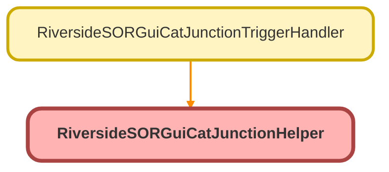

---
hide:
  - path
---

# RiversideSORGuiCatJunctionHelper Class

## Class Diagram



<!-- Apex description -->

## Apex Code

```java
public with sharing class RiversideSORGuiCatJunctionHelper {
    public static void updateExternalIdentifier(Set<Id> junctionids) {
        List<Riverside_SOR_Category_Guidance_Junction__c> junctionsToUpdate = [SELECT Id, ExternalIdentifier__c FROM Riverside_SOR_Category_Guidance_Junction__c WHERE Id IN :junctionids AND ExternalIdentifier__c = null];
        if (!junctionsToUpdate.isEmpty()) {
            for (Riverside_SOR_Category_Guidance_Junction__c junction : junctionsToUpdate) {
                junction.ExternalIdentifier__c = 'RSGCJ' + junction.Id;
            }
            update junctionsToUpdate;
        }
    }
}
```

## Methods
### `updateExternalIdentifier(junctionids)`

#### Signature
```apex
public static void updateExternalIdentifier(Set<Id> junctionids)
```

#### Parameters
| Name | Type | Description |
|------|------|-------------|
| junctionids | Set<Id> |  |

#### Return Type
**void**