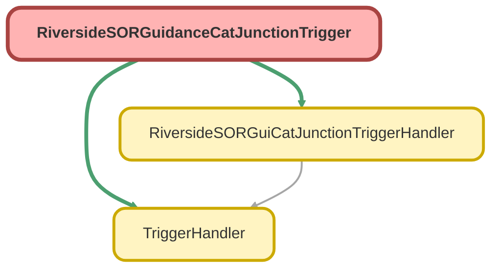

---
hide:
  - path
---

# RiversideSORGuidanceCatJunctionTrigger Trigger

## Class Diagram



<!-- Apex description -->

## Apex Code

```java
trigger RiversideSORGuidanceCatJunctionTrigger on Riverside_SOR_Category_Guidance_Junction__c (before insert, before update, before delete, after insert, after update, after delete, after undelete) {
    new RiversideSORGuiCatJunctionTriggerHandler().run();
}
```

## Trigger On Riverside_SOR_Category_Guidance_Junction__c

**Run**
* Before Insert
* Before Update
* Before Delete
* After Insert
* After Update
* After Delete
* After Undelete