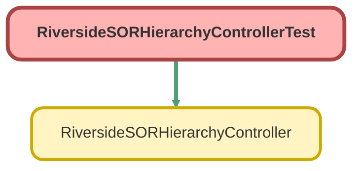

---
hide:
  - path
---

# RiversideSORHierarchyControllerTest Class

`ISTEST`

## Class Diagram



<!-- Apex description -->

## Apex Code

```java
@isTest
public class RiversideSORHierarchyControllerTest {
    
    @testSetup
    static void setup() {
        // Create test profile
        Riverside_SOR_Code_Profile__c profile = new Riverside_SOR_Code_Profile__c(
            Name = 'Test Profile',
            Description__c = 'Test Description',
            ExternalIdentifier__c = 'TestProfile'
        );
        insert profile;
        
        // Create test categories
        Riverside_SOR_Category__c rootCategory = new Riverside_SOR_Category__c(
            Label__c = 'Root Category',
            EditModeLabel__c = 'Root',
            ExternalIdentifier__c = 'RootCat'
        );
        insert rootCategory;
        
        Riverside_SOR_Category__c childCategory = new Riverside_SOR_Category__c(
            Label__c = 'Child Category',
            EditModeLabel__c = 'Child',
            ParentCategoryLookup__c = rootCategory.Id,
            ExternalIdentifier__c = 'ChildCat'
        );
        insert childCategory;
        
        // Create test SOR codes
        Id sorRecordTypeId = Schema.SObjectType.Riverside_SOR_Code__c.getRecordTypeInfosByDeveloperName().get('SORCode').getRecordTypeId();
        
        Riverside_SOR_Code__c sor1 = new Riverside_SOR_Code__c(
            SORCodeText__c = 'TEST001',
            SORHeadingText__c = 'Test SOR 1',
            SORDescriptionText__c = 'Test Description 1',
            RecordTypeId = sorRecordTypeId
        );
        insert sor1;
        
        Riverside_SOR_Code__c sor2 = new Riverside_SOR_Code__c(
            SORCodeText__c = 'TEST002',
            SORHeadingText__c = 'Test SOR 2',
            SORDescriptionText__c = 'Test Description 2',
            RecordTypeId = sorRecordTypeId
        );
        insert sor2;
        
        // Create SOR to Category junctions
        Riverside_SOR_Category_Junction__c catJunction1 = new Riverside_SOR_Category_Junction__c(
            Riverside_SOR_Code__c = sor1.Id,
            Riverside_SOR_Category__c = rootCategory.Id
        );
        insert catJunction1;
        
        Riverside_SOR_Category_Junction__c catJunction2 = new Riverside_SOR_Category_Junction__c(
            Riverside_SOR_Code__c = sor1.Id,
            Riverside_SOR_Category__c = childCategory.Id
        );
        insert catJunction2;
        
        Riverside_SOR_Category_Junction__c catJunction3 = new Riverside_SOR_Category_Junction__c(
            Riverside_SOR_Code__c = sor2.Id,
            Riverside_SOR_Category__c = childCategory.Id
        );
        insert catJunction3;
        
        // Create SOR to Profile junctions
        Riverside_SOR_Junction__c sorJunction1 = new Riverside_SOR_Junction__c(
            SORCode__c = sor1.Id,
            SORProfile__c = profile.Id
        );
        insert sorJunction1;
        
        Riverside_SOR_Junction__c sorJunction2 = new Riverside_SOR_Junction__c(
            SORCode__c = sor2.Id,
            SORProfile__c = profile.Id
        );
        insert sorJunction2;
        
        // Create Category to Profile junctions
        Riverside_SOR_Junction__c catProfileJunction1 = new Riverside_SOR_Junction__c(
            SORCategory__c = rootCategory.Id,
            SORProfile__c = profile.Id
        );
        insert catProfileJunction1;
        
        Riverside_SOR_Junction__c catProfileJunction2 = new Riverside_SOR_Junction__c(
            SORCategory__c = childCategory.Id,
            SORProfile__c = profile.Id
        );
        insert catProfileJunction2;
    }
    
    @isTest
    static void testGetSORHierarchyData() {
        Test.startTest();
        List<RiversideSORHierarchyController.SORHierarchyData> results = 
            RiversideSORHierarchyController.getSORHierarchyData('Test Profile', false);
        Test.stopTest();
        
        System.assertNotEquals(null, results, 'Results should not be null');
        System.assert(results.size() > 0, 'Should return at least one record');
        
        // Verify data structure
        RiversideSORHierarchyController.SORHierarchyData firstRecord = results[0];
        System.assertNotEquals(null, firstRecord.sorId, 'SOR ID should not be null');
        System.assertNotEquals(null, firstRecord.sorCode, 'SOR Code should not be null');
        System.assertNotEquals(null, firstRecord.categoryPath, 'Category path should not be null');
        System.assertNotEquals(null, firstRecord.isAccessible, 'Accessible flag should not be null');
    }
    
    @isTest
    static void testGetSORHierarchyDataInvalidProfile() {
        Test.startTest();
        List<RiversideSORHierarchyController.SORHierarchyData> results = 
            RiversideSORHierarchyController.getSORHierarchyData('Nonexistent Profile', false);
        Test.stopTest();
        
        System.assertEquals(0, results.size(), 'Should return empty list for invalid profile');
    }
    
    @isTest
    static void testGetProfileOptions() {
        Test.startTest();
        List<Map<String, String>> options = RiversideSORHierarchyController.getProfileOptions();
        Test.stopTest();
        
        System.assertNotEquals(null, options, 'Options should not be null');
        System.assert(options.size() > 0, 'Should return at least one profile option');
        
        // Verify structure
        Map<String, String> firstOption = options[0];
        System.assert(firstOption.containsKey('label'), 'Option should have label key');
        System.assert(firstOption.containsKey('value'), 'Option should have value key');
    }
    
    @isTest
    static void testBuildCategoryPathWithMultipleLevels() {
        // This tests the recursive path building
        Test.startTest();
        List<RiversideSORHierarchyController.SORHierarchyData> results = 
            RiversideSORHierarchyController.getSORHierarchyData('Test Profile', true);
        Test.stopTest();
        
        // Find a record with child category path
        Boolean foundChildPath = false;
        for (RiversideSORHierarchyController.SORHierarchyData data : results) {
            if (data.categoryPath.contains('>')) {
                foundChildPath = true;
                System.assert(data.categoryPath.contains('Root Category'), 'Path should contain root category');
                System.assert(data.categoryPath.contains('Child Category'), 'Path should contain child category');
                break;
            }
        }
        
        System.assert(foundChildPath, 'Should find at least one multi-level category path');
    }
    
    @isTest
    static void testAccessibilityCheck() {
        // Create a category not assigned to profile
        Riverside_SOR_Category__c inaccessibleCategory = new Riverside_SOR_Category__c(
            Label__c = 'Inaccessible Category',
            EditModeLabel__c = 'Inaccessible',
            ExternalIdentifier__c = 'InaccessibleCat'
        );
        insert inaccessibleCategory;
        
        // Get an existing SOR
        Riverside_SOR_Code__c existingSor = [SELECT Id FROM Riverside_SOR_Code__c LIMIT 1];
        
        // Create junction to inaccessible category
        Riverside_SOR_Category_Junction__c catJunction = new Riverside_SOR_Category_Junction__c(
            Riverside_SOR_Code__c = existingSor.Id,
            Riverside_SOR_Category__c = inaccessibleCategory.Id
        );
        insert catJunction;
        
        Test.startTest();
        List<RiversideSORHierarchyController.SORHierarchyData> results = 
            RiversideSORHierarchyController.getSORHierarchyData('Test Profile', false);
        Test.stopTest();
        
        // Find the inaccessible path
        Boolean foundInaccessiblePath = false;
        for (RiversideSORHierarchyController.SORHierarchyData data : results) {
            if (data.categoryPath.contains('Inaccessible Category')) {
                foundInaccessiblePath = true;
                System.assertEquals(false, data.isAccessible, 'Path should be marked as inaccessible');
                break;
            }
        }
        
        System.assert(foundInaccessiblePath, 'Should find the inaccessible path');
    }
    
    @isTest
    static void testEmptyCategoryPath() {
        // Test with null category map
        Test.startTest();
        List<RiversideSORHierarchyController.SORHierarchyData> results = 
            RiversideSORHierarchyController.getSORHierarchyData('Test Profile', false);
        Test.stopTest();
        
        // All results should have a category path (even if it's 'Unknown')
        for (RiversideSORHierarchyController.SORHierarchyData data : results) {
            System.assertNotEquals(null, data.categoryPath, 'Category path should not be null');
            System.assertNotEquals('', data.categoryPath, 'Category path should not be empty');
        }
    }
    
    @isTest
    static void testMultipleSORsInSameCategory() {
        Test.startTest();
        List<RiversideSORHierarchyController.SORHierarchyData> results = 
            RiversideSORHierarchyController.getSORHierarchyData('Test Profile', false);
        Test.stopTest();
        
        // Should have multiple records for the child category
        Integer childCategoryCount = 0;
        for (RiversideSORHierarchyController.SORHierarchyData data : results) {
            if (data.categoryPath.contains('Child Category')) {
                childCategoryCount++;
            }
        }
        
        System.assert(childCategoryCount >= 2, 'Should have at least 2 SORs in child category');
    }
    
    @isTest
    static void testIncludeCloseups() {
        // Create a closeup category
        Id closeupRecordTypeId = Schema.SObjectType.Riverside_SOR_Category__c.getRecordTypeInfosByDeveloperName().get('RepairLocationCloseup').getRecordTypeId();
        
        Riverside_SOR_Category__c closeupCategory = new Riverside_SOR_Category__c(
            Label__c = 'Closeup Category',
            EditModeLabel__c = 'Closeup',
            ExternalIdentifier__c = 'CloseupCat',
            RecordTypeId = closeupRecordTypeId
        );
        insert closeupCategory;
        
        // Get existing profile
        Riverside_SOR_Code_Profile__c profile = [SELECT Id FROM Riverside_SOR_Code_Profile__c WHERE Name = 'Test Profile' LIMIT 1];
        
        // Create junction
        Riverside_SOR_Junction__c catProfileJunction = new Riverside_SOR_Junction__c(
            SORCategory__c = closeupCategory.Id,
            SORProfile__c = profile.Id
        );
        insert catProfileJunction;
        
        Test.startTest();
        List<RiversideSORHierarchyController.SORHierarchyData> resultsWithCloseup = 
            RiversideSORHierarchyController.getSORHierarchyData('Test Profile', true);
        List<RiversideSORHierarchyController.SORHierarchyData> resultsWithoutCloseup = 
            RiversideSORHierarchyController.getSORHierarchyData('Test Profile', false);
        Test.stopTest();
        
        System.assertNotEquals(null, resultsWithCloseup, 'Results with closeup should not be null');
        System.assertNotEquals(null, resultsWithoutCloseup, 'Results without closeup should not be null');
    }
}

```

## Methods
### `setup()`

`TESTSETUP`

#### Signature
```apex
private static void setup()
```

#### Return Type
**void**

---

### `testGetSORHierarchyData()`

`ISTEST`

#### Signature
```apex
private static void testGetSORHierarchyData()
```

#### Return Type
**void**

---

### `testGetSORHierarchyDataInvalidProfile()`

`ISTEST`

#### Signature
```apex
private static void testGetSORHierarchyDataInvalidProfile()
```

#### Return Type
**void**

---

### `testGetProfileOptions()`

`ISTEST`

#### Signature
```apex
private static void testGetProfileOptions()
```

#### Return Type
**void**

---

### `testBuildCategoryPathWithMultipleLevels()`

`ISTEST`

#### Signature
```apex
private static void testBuildCategoryPathWithMultipleLevels()
```

#### Return Type
**void**

---

### `testAccessibilityCheck()`

`ISTEST`

#### Signature
```apex
private static void testAccessibilityCheck()
```

#### Return Type
**void**

---

### `testEmptyCategoryPath()`

`ISTEST`

#### Signature
```apex
private static void testEmptyCategoryPath()
```

#### Return Type
**void**

---

### `testMultipleSORsInSameCategory()`

`ISTEST`

#### Signature
```apex
private static void testMultipleSORsInSameCategory()
```

#### Return Type
**void**

---

### `testIncludeCloseups()`

`ISTEST`

#### Signature
```apex
private static void testIncludeCloseups()
```

#### Return Type
**void**