---
hide:
  - path
---

# TriggerHandler Class
`virtual`

Virtual class to provide a framework for a trigger handler that can be extended to 
provide the required actions for each trigger context. Utilising a defined run method 
that will carryout the appropriate method for the current trigger context.

## Class Diagram

```mermaid
graph TD
  TriggerHandler["TriggerHandler"]:::mainApexClass
  click TriggerHandler "/objects/TriggerHandler/"
  TriggerHandlerException["TriggerHandlerException"]:::apexClass
  click TriggerHandlerException "/apex/TriggerHandlerException/"
  MockTriggerHandler["MockTriggerHandler"]:::apexClass
  click MockTriggerHandler "/apex/MockTriggerHandler/"
  RiversideSORCategoryJunctionTrigHandler["RiversideSORCategoryJunctionTrigHandler"]:::apexClass
  click RiversideSORCategoryJunctionTrigHandler "/apex/RiversideSORCategoryJunctionTrigHandler/"
  RiversideSORGuiCatJunctionTriggerHandler["RiversideSORGuiCatJunctionTriggerHandler"]:::apexClass
  click RiversideSORGuiCatJunctionTriggerHandler "/apex/RiversideSORGuiCatJunctionTriggerHandler/"
  RiversideSORGuidanceCatJunctionTrigger["RiversideSORGuidanceCatJunctionTrigger"]:::apexClass
  click RiversideSORGuidanceCatJunctionTrigger "/apex/RiversideSORGuidanceCatJunctionTrigger/"
  RiversideSORJunctionTrigger["RiversideSORJunctionTrigger"]:::apexClass
  click RiversideSORJunctionTrigger "/apex/RiversideSORJunctionTrigger/"
  RiversideSORJunctionTriggerHandler["RiversideSORJunctionTriggerHandler"]:::apexClass
  click RiversideSORJunctionTriggerHandler "/apex/RiversideSORJunctionTriggerHandler/"
  TriggerHandlerTest["TriggerHandlerTest"]:::apexTestClass
  click TriggerHandlerTest "/apex/TriggerHandlerTest/"

  TriggerHandler --> TriggerHandlerException

  MockTriggerHandler --> TriggerHandler
  RiversideSORCategoryJunctionTrigHandler --> TriggerHandler
  RiversideSORGuiCatJunctionTriggerHandler --> TriggerHandler
  RiversideSORGuidanceCatJunctionTrigger --> TriggerHandler
  RiversideSORJunctionTrigger --> TriggerHandler
  RiversideSORJunctionTriggerHandler --> TriggerHandler
  TriggerHandlerException --> TriggerHandler
  TriggerHandlerTest --> TriggerHandler

  RiversideSORGuidanceCatJunctionTrigger --> RiversideSORGuiCatJunctionTriggerHandler
  RiversideSORJunctionTrigger --> RiversideSORJunctionTriggerHandler
  RiversideSORJunctionTriggerHandler --> RiversideSORJunctionTrigger
  TriggerHandlerTest --> MockTriggerHandler
  TriggerHandlerTest --> TriggerHandlerException

classDef apexClass fill:#FFF4C2,stroke:#CCAA00,stroke-width:3px,rx:12px,ry:12px,shadow:drop,color:#333;
classDef apexTestClass fill:#F5F5F5,stroke:#999999,stroke-width:3px,rx:12px,ry:12px,shadow:drop,color:#333;
classDef mainApexClass fill:#FFB3B3,stroke:#A94442,stroke-width:4px,rx:14px,ry:14px,shadow:drop,color:#333,font-weight:bold;

linkStyle 0 stroke:#4C9F70,stroke-width:4px;
linkStyle 1,2,3,4,5,6,7,8 stroke:#FF8C00,stroke-width:2px;
linkStyle 9,10,11,12,13 stroke:#A6A6A6,stroke-width:2px;
```



<!-- Apex description -->

## Apex Code

```java
/**
* @description Virtual class to provide a framework for a trigger handler that can be extended to
*			   provide the required actions for each trigger context. Utilising a defined run method
*			   that will carryout the appropriate method for the current trigger context.
**/
public virtual class TriggerHandler {
	
	@TestVisible public enum TriggerContext { BEFORE_INSERT, BEFORE_UPDATE, BEFORE_DELETE, 
								AFTER_INSERT, AFTER_UPDATE, AFTER_DELETE, AFTER_UNDELETE }

	
	private static Map<String,Set<TriggerContext>> bypassHandlers;
	static {
		bypassHandlers = new Map<String,Set<TriggerContext>>();
	}
	
	
	@TestVisible private Boolean isExecuting;
	@TestVisible private TriggerContext context;
	
	public TriggerHandler() {
		this.setTriggerContext();
	}
	
	@TestVisible protected Integer recursionCount = 0;
	@TestVisible protected Integer maxRecursion;
	@TestVisible protected void setMaxRecursion(Integer value){
		maxRecursion = value;
	}
	
	protected virtual void beforeInsert(){}
	protected virtual void beforeUpdate(){}
	protected virtual void beforeDelete(){}
	protected virtual void afterInsert(){}
	protected virtual void afterUpdate(){}
	protected virtual void afterDelete(){}
	protected virtual void afterUndelete(){}

	/**
	* @description The run method is called to carryout the method for the given trigger context.
	*			   If an override has not being provided on the trigger handler extending this class
	*			   the method will remain blank and therefor no action will be taken.
	**/
	public void run(){
		
		//Validate the trigger before running the action for the given context
		if( !isValid() ){ return; }
		
		//Identify trigger context and run the appropriate action.
		if(this.context == TriggerContext.BEFORE_INSERT){
			this.beforeInsert();
		}else if(this.context == TriggerContext.BEFORE_UPDATE){
			this.beforeUpdate();
		}else if(this.context == TriggerContext.BEFORE_DELETE){
			this.beforeDelete();
		}else if(this.context == TriggerContext.AFTER_INSERT){
			this.afterInsert();
		}else if(this.context == TriggerContext.AFTER_UPDATE){
			this.afterUpdate();
		}else if(this.context == TriggerContext.AFTER_DELETE){
			this.afterDelete();
		}else if(this.context == TriggerContext.AFTER_UNDELETE){
			this.afterUndelete();
		}
		
		//Increment the recursion counter
		recursionCount++;
	}
	
	/**
	* @description validate the trigger.
	* @return Boolean -
	*			   TRUE - If maxRecursion NULL & TriggerHandler NOT bypassed.
	*			   TRUE - If maxRecursion < recursionCount & TriggerHandler NOT bypassed.
	*			   FALSE - If recursionCount has reached maxRecursion.
	*			   FALSE - If all TriggerHandler is bypassed or current TriggerHandler context is
	*					   bypassed.
	* @throws TriggerHandlerException - when handlerName is null
	**/
	@TestVisible private Boolean isValid(){
		//Check for trigger context
		if(this.context == null){
			throw new TriggerHandlerException('A trigger cannot run without a specified context.');
		}
		
		//Check has not reached maxRecursion & Trigger Handler is not bypassed for current context.
		if((maxRecursion != null && recursionCount >= maxRecursion)
			|| (TriggerHandler.bypassHandlers.containsKey(getName())
				&& (TriggerHandler.bypassHandlers.get(getName()) == null
					|| TriggerHandler.bypassHandlers.get(getName()).size() == 7
					|| TriggerHandler.bypassHandlers.get(getName()).contains(this.context) ))){
			return false;
		}
		
		return true;
	}
	
	/**
	* @description retrieves the class name for a given TriggerHandler.
	* @return String - Trigger Handler name.
	**/
	@TestVisible private String getName(){
		return String.valueOf(this).substring(0,String.valueOf(this).indexOf(':'));
	}
	
	/**
	* @description bypass a TriggerHandler given the name of the TriggerHandler class.
	* @params handlerName - the name of the TriggerHandler to be bypassed.
	* @throws TriggerHandlerException - when handlerName is null
	* @throws TriggerHandlerException - when handlerName is empty
	* @throws TriggerHandlerException - when handlerName is not a valid TriggerHandler, is not a
	*		  class that extends TriggerHandler.
	**/
	public static void bypass(String handlerName){
		bypass(handlerName, new Set<TriggerContext>());
	}
	
	/**
	* @description bypass a TriggerHandler context given the name of the TriggerHandler class and
	*			   the context for bypass.
	* @params handlerName - the name of the TriggerHandler to be bypassed.
	* @params context - the TriggerContext to bypass if null full trigger bypass.
	* @throws TriggerHandlerException - when handlerName is null
	* @throws TriggerHandlerException - when handlerName is empty
	* @throws TriggerHandlerException - when handlerName is not a valid TriggerHandler, is not a
	*		  class that extends TriggerHandler.
	**/
	public static void bypass(String handlerName, TriggerContext context){
		bypass(handlerName, new Set<TriggerContext>{context});
	}
	
	/**
	* @description bypass a TriggerHandler contexts given the name of the TriggerHandler class and
	*			   the contexts for bypass.
	* @params handlerName - the name of the TriggerHandler to be bypassed.
	* @params contexts - the TriggerContexts to bypass if null or empty full trigger bypass.
	* @throws TriggerHandlerException - when handlerName is null
	* @throws TriggerHandlerException - when handlerName is empty
	* @throws TriggerHandlerException - when handlerName is not a valid TriggerHandler, is not a
	*		  class that extends TriggerHandler.
	**/
	public static void bypass(String handlerName, Set<TriggerContext> contexts){
		//Ensure that the trigger handler is a valid TriggerHandler.
		validateIsTriggerHandler(handlerName);
		
		if(contexts != null && contexts.size() > 0){
			if(TriggerHandler.bypassHandlers.containsKey(handlerName)
				&& TriggerHandler.bypassHandlers.get(handlerName) != null){
				Set<TriggerContext> bypassedContexts = TriggerHandler.bypassHandlers.get(handlerName);
				contexts.addAll(bypassedContexts);
			}
			
			TriggerHandler.bypassHandlers.put(handlerName,contexts);
		}else{
			TriggerHandler.bypassHandlers.put(handlerName, new Set<TriggerContext>{
																TriggerContext.BEFORE_INSERT,
																TriggerContext.BEFORE_UPDATE,
																TriggerContext.BEFORE_DELETE,
																TriggerContext.AFTER_INSERT,
																TriggerContext.AFTER_UPDATE,
																TriggerContext.AFTER_DELETE,
																TriggerContext.AFTER_UNDELETE
															});
		}
	}
	
	/**
	* @description clear the bypass of TriggerHandler given the name of the TriggerHandler class for
	*			   all contexts.
	* @params handlerName - the name of the TriggerHandler to be cleared from the bypassed list.
	* @throws TriggerHandlerException - when handlerName is null
	* @throws TriggerHandlerException - when handlerName is empty
	* @throws TriggerHandlerException - when handlerName is not a valid TriggerHandler, is not a
	*		  class that extends TriggerHandler.
	**/
	public static void clearBypass(String handlerName){
		clearBypass(handlerName, new Set<TriggerContext>());
	}
	
	/**
	* @description clear the bypass of TriggerHandler given the name of the TriggerHandler class for
	*			   given context.
	* @params handlerName - the name of the TriggerHandler to be cleared from the bypassed list.
	* @params contexts - the TriggerContext to clear bypass for if null or empty clear all trigger 
	* 					 context bypasses.
	* @throws TriggerHandlerException - when handlerName is null
	* @throws TriggerHandlerException - when handlerName is empty
	* @throws TriggerHandlerException - when handlerName is not a valid TriggerHandler, is not a
	*		  class that extends TriggerHandler.
	**/
	public static void clearBypass(String handlerName, TriggerContext context){
		clearBypass(handlerName, new Set<TriggerContext>{context});
	}
	
	/**
	* @description clear the bypass of TriggerHandler given the name of the TriggerHandler class for
	*			   given contexts.
	* @params handlerName - the name of the TriggerHandler to be cleared from the bypassed list.
	* @params contexts - the TriggerContexts to clear bypasses for if null or empty clear all trigger 
	* 					 context bypasses.
	* @throws TriggerHandlerException - when handlerName is null
	* @throws TriggerHandlerException - when handlerName is empty
	* @throws TriggerHandlerException - when handlerName is not a valid TriggerHandler, is not a
	*		  class that extends TriggerHandler.
	**/
	public static void clearBypass(String handlerName, Set<TriggerContext> contexts){
		//Ensure that the trigger handler is a valid TriggerHandler.
		validateIsTriggerHandler(handlerName);
		
		if(contexts != null && contexts.size() > 0){
			for(TriggerContext context : contexts){
				if(TriggerHandler.bypassHandlers.containsKey(handlerName)
					&& TriggerHandler.bypassHandlers.get(handlerName) != null
					&& TriggerHandler.bypassHandlers.get(handlerName).contains(context)){
					
					TriggerHandler.bypassHandlers.get(handlerName).remove(context);
					
					//If no contexts remain remove bypass
					if(TriggerHandler.bypassHandlers.get(handlerName).size() == 0){
						TriggerHandler.bypassHandlers.remove(handlerName);
					}
				}
			}
		}else{
			TriggerHandler.bypassHandlers.remove(handlerName);
		}
	}
	
	/**
	* @description clear the bypass of all TriggerHandlers for all contexts, so that they are all
	* 			   active again.
	**/
	public static void clearAllBypasses(){
		TriggerHandler.bypassHandlers.clear();
	}
	
	/**
	* @description check is a TriggerHandler is bypassed given the name of the TriggerHandler class.
	* @params handlerName - the name of the TriggerHandler to check if bypassed.
	* @return Boolean - returns true if the handler passed in is bypassed.
	* @throws TriggerHandlerException - when handlerName is null.
	* @throws TriggerHandlerException - when handlerName is empty.
	* @throws TriggerHandlerException - when handlerName is not a valid TriggerHandler, is not a
	*		  class that extends TriggerHandler.
	**/
	public static Boolean isBypassed(String handlerName){
		return isBypassed(handlerName, new Set<TriggerContext>());
	}
	
	/**
	* @description check is a TriggerHandler is bypassed given the name of the TriggerHandler class
	*			   and a context to validate, if no context is given, will validate if the whole
	*			   trigger is bypassed.
	* @params handlerName - the name of the TriggerHandler to check if bypassed.
	* @params context - the TriggerContext to check if bypass if null check for full trigger bypass.
	* @return Boolean - returns true if the handler context passed in is bypassed.
	* @throws TriggerHandlerException - when handlerName is null.
	* @throws TriggerHandlerException - when handlerName is empty.
	* @throws TriggerHandlerException - when handlerName is not a valid TriggerHandler, is not a
	*		  class that extends TriggerHandler.
	**/
	public static Boolean isBypassed(String handlerName, TriggerContext context){
		return isBypassed(handlerName, new Set<TriggerContext>{context});
	}
	
	/**
	* @description check is a TriggerHandler is bypassed given the name of the TriggerHandler class
	*			   and the contexts to validate, if no contexts given will validate if the whole
	*			   trigger is bypassed.
	* @params handlerName - the name of the TriggerHandler to check if bypassed.
	* @params contexts - the TriggerContexts to check if bypass if null check for full trigger bypass.
	* @return Boolean - returns true if the handler context passed in is bypassed.
	* @throws TriggerHandlerException - when handlerName is null.
	* @throws TriggerHandlerException - when handlerName is empty.
	* @throws TriggerHandlerException - when handlerName is not a valid TriggerHandler, is not a
	*		  class that extends TriggerHandler.
	**/
	public static Boolean isBypassed(String handlerName, Set<TriggerContext> contexts){
		//Ensure that the trigger handler is a valid TriggerHandler.
		validateIsTriggerHandler(handlerName);
		
		if(contexts == null || contexts.size() == 0){
			//If the trigger is bypasses with no specified context then the whole trigger is
			//bypassed, if all 7 trigger context are bypassed then the whole trigger is bypassed.
			if(TriggerHandler.bypassHandlers.containsKey(handlerName)
				&& (TriggerHandler.bypassHandlers.get(handlerName) == null
					|| TriggerHandler.bypassHandlers.get(handlerName).size() == 7)){
				return true;
			}
		}else{
			//check for bypass of contexts.
			Set<TriggerContext> bypassedContexts = TriggerHandler.bypassHandlers.get(handlerName);
			//If any of the given contexts are not bypassed, return false.
			for(TriggerContext context : contexts){
				if(bypassedContexts == null || !bypassedContexts.contains(context)){
					return false;
				}
			}
			
			//If all given contexts are bypassed, return true.
			return true;
		}
		
		return false;
	}
	
	/**
	* @description The trigger context for the trigger handler is set based on the current
	*			   salesforce Trigger context, where a trigger is currently executing.
	**/
	@TestVisible private void setTriggerContext(){
		this.setTriggerContext(null);
	}
	
	/**
	* @description provide a way to set the trigger context so that we can test how any trigger
	*			   handler behaves in a given scenario.
	* @param givenContext - If a givenContext is provided the trigger handler works in test mode
	*						if not provided the context is taken from the Trigger instance and
	*						will work as expected for the current trigger context.
	**/
	@TestVisible private void setTriggerContext(TriggerContext givenContext){
		
		if(!Trigger.isExecuting && givenContext == null){
			this.isExecuting = false;
			return;
		}
		
		this.isExecuting = true;
		
		if(Trigger.isExecuting){
			if(Trigger.isBefore && Trigger.isInsert){
				this.context = TriggerContext.BEFORE_INSERT;
			}else if(Trigger.isBefore && Trigger.isUpdate){
				this.context = TriggerContext.BEFORE_UPDATE;
			}else if(Trigger.isBefore && Trigger.isDelete){
				this.context = TriggerContext.BEFORE_DELETE;
			}else if(Trigger.isAfter && Trigger.isInsert){
				this.context = TriggerContext.AFTER_INSERT;
			}else if(Trigger.isAfter && Trigger.isUpdate){
				this.context = TriggerContext.AFTER_UPDATE;
			}else if(Trigger.isAfter && Trigger.isDelete){
				this.context = TriggerContext.AFTER_DELETE;
			}else if(Trigger.isAfter && Trigger.isUndelete){
				this.context = TriggerContext.AFTER_UNDELETE;
			}
		}else if(givenContext != null){
			this.context = givenContext;
		}
	}
	
	/**
	* @description validate if a class is a TriggerHandler given the name of the class.
	* @params handlerName - the name of the TriggerHandler to validate.
	* @throws TriggerHandlerException - when handlerName is null
	* @throws TriggerHandlerException - when handlerName is empty
	* @throws TriggerHandlerException - when handlerName is not a valid TriggerHandler, is not a
	*		  class that extends TriggerHandler.
	**/
	@TestVisible private static void validateIsTriggerHandler(String handlerName){
		if(handlerName == null || handlerName == ''){
			throw new TriggerHandlerException('To bypass a trigger handler a handler name must be provided.');
		}
		
		Object classInstance = Type.forName(handlerName).newInstance();
		
		if(!(classInstance instanceof TriggerHandler)){
			throw new TriggerHandlerException('Unrecognised TriggerHandler Class');
		}
	}

}
```

## Fields
### `bypassHandlers`

#### Signature
```apex
private static bypassHandlers
```

#### Type
Map<String,Set<TriggerContext>>

---

### `isExecuting`

`TESTVISIBLE`

#### Signature
```apex
private isExecuting
```

#### Type
Boolean

---

### `context`

`TESTVISIBLE`

#### Signature
```apex
private context
```

#### Type
TriggerContext

## Constructors
### `TriggerHandler()`

#### Signature
```apex
public TriggerHandler()
```

## Methods
### `run()`

The run method is called to carryout the method for the given trigger context. 
If an override has not being provided on the trigger handler extending this class 
the method will remain blank and therefor no action will be taken.

#### Signature
```apex
public void run()
```

#### Return Type
**void**

---

### `isValid()`

`TESTVISIBLE`

validate the trigger.

#### Signature
```apex
private Boolean isValid()
```

#### Return Type
**Boolean**

Boolean -,[object Object],			   TRUE - If maxRecursion NULL &amp; TriggerHandler NOT bypassed.,[object Object],			   TRUE - If maxRecursion &lt; recursionCount &amp; TriggerHandler NOT bypassed.,[object Object],			   FALSE - If recursionCount has reached maxRecursion.,[object Object],			   FALSE - If all TriggerHandler is bypassed or current TriggerHandler context is,[object Object],					   bypassed.

#### Throws
[TriggerHandlerException](TriggerHandlerException.md): - when handlerName is null

---

### `getName()`

`TESTVISIBLE`

retrieves the class name for a given TriggerHandler.

#### Signature
```apex
private String getName()
```

#### Return Type
**String**

String - Trigger Handler name.

---

### `bypass(handlerName)`

bypass a TriggerHandler given the name of the TriggerHandler class.

#### Signature
```apex
public static void bypass(String handlerName)
```

#### Parameters
| Name | Type | Description |
|------|------|-------------|
| handlerName | String |  |

#### Return Type
**void**

#### Throws
[TriggerHandlerException](TriggerHandlerException.md): - when handlerName is null

[TriggerHandlerException](TriggerHandlerException.md): - when handlerName is empty

[TriggerHandlerException](TriggerHandlerException.md): - when handlerName is not a valid TriggerHandler, is not a,[object Object],		  class that extends TriggerHandler.

---

### `bypass(handlerName, context)`

bypass a TriggerHandler context given the name of the TriggerHandler class and 
the context for bypass.

#### Signature
```apex
public static void bypass(String handlerName, TriggerContext context)
```

#### Parameters
| Name | Type | Description |
|------|------|-------------|
| handlerName | String |  |
| context | TriggerContext |  |

#### Return Type
**void**

#### Throws
[TriggerHandlerException](TriggerHandlerException.md): - when handlerName is null

[TriggerHandlerException](TriggerHandlerException.md): - when handlerName is empty

[TriggerHandlerException](TriggerHandlerException.md): - when handlerName is not a valid TriggerHandler, is not a,[object Object],		  class that extends TriggerHandler.

---

### `bypass(handlerName, contexts)`

bypass a TriggerHandler contexts given the name of the TriggerHandler class and 
the contexts for bypass.

#### Signature
```apex
public static void bypass(String handlerName, Set<TriggerContext> contexts)
```

#### Parameters
| Name | Type | Description |
|------|------|-------------|
| handlerName | String |  |
| contexts | Set<TriggerContext> |  |

#### Return Type
**void**

#### Throws
[TriggerHandlerException](TriggerHandlerException.md): - when handlerName is null

[TriggerHandlerException](TriggerHandlerException.md): - when handlerName is empty

[TriggerHandlerException](TriggerHandlerException.md): - when handlerName is not a valid TriggerHandler, is not a,[object Object],		  class that extends TriggerHandler.

---

### `clearBypass(handlerName)`

clear the bypass of TriggerHandler given the name of the TriggerHandler class for 
all contexts.

#### Signature
```apex
public static void clearBypass(String handlerName)
```

#### Parameters
| Name | Type | Description |
|------|------|-------------|
| handlerName | String |  |

#### Return Type
**void**

#### Throws
[TriggerHandlerException](TriggerHandlerException.md): - when handlerName is null

[TriggerHandlerException](TriggerHandlerException.md): - when handlerName is empty

[TriggerHandlerException](TriggerHandlerException.md): - when handlerName is not a valid TriggerHandler, is not a,[object Object],		  class that extends TriggerHandler.

---

### `clearBypass(handlerName, context)`

clear the bypass of TriggerHandler given the name of the TriggerHandler class for 
given context.

#### Signature
```apex
public static void clearBypass(String handlerName, TriggerContext context)
```

#### Parameters
| Name | Type | Description |
|------|------|-------------|
| handlerName | String |  |
| context | TriggerContext |  |

#### Return Type
**void**

#### Throws
[TriggerHandlerException](TriggerHandlerException.md): - when handlerName is null

[TriggerHandlerException](TriggerHandlerException.md): - when handlerName is empty

[TriggerHandlerException](TriggerHandlerException.md): - when handlerName is not a valid TriggerHandler, is not a,[object Object],		  class that extends TriggerHandler.

---

### `clearBypass(handlerName, contexts)`

clear the bypass of TriggerHandler given the name of the TriggerHandler class for 
given contexts.

#### Signature
```apex
public static void clearBypass(String handlerName, Set<TriggerContext> contexts)
```

#### Parameters
| Name | Type | Description |
|------|------|-------------|
| handlerName | String |  |
| contexts | Set<TriggerContext> |  |

#### Return Type
**void**

#### Throws
[TriggerHandlerException](TriggerHandlerException.md): - when handlerName is null

[TriggerHandlerException](TriggerHandlerException.md): - when handlerName is empty

[TriggerHandlerException](TriggerHandlerException.md): - when handlerName is not a valid TriggerHandler, is not a,[object Object],		  class that extends TriggerHandler.

---

### `clearAllBypasses()`

clear the bypass of all TriggerHandlers for all contexts, so that they are all 
active again.

#### Signature
```apex
public static void clearAllBypasses()
```

#### Return Type
**void**

---

### `isBypassed(handlerName)`

check is a TriggerHandler is bypassed given the name of the TriggerHandler class.

#### Signature
```apex
public static Boolean isBypassed(String handlerName)
```

#### Parameters
| Name | Type | Description |
|------|------|-------------|
| handlerName | String |  |

#### Return Type
**Boolean**

Boolean - returns true if the handler passed in is bypassed.

#### Throws
[TriggerHandlerException](TriggerHandlerException.md): - when handlerName is null.

[TriggerHandlerException](TriggerHandlerException.md): - when handlerName is empty.

[TriggerHandlerException](TriggerHandlerException.md): - when handlerName is not a valid TriggerHandler, is not a,[object Object],		  class that extends TriggerHandler.

---

### `isBypassed(handlerName, context)`

check is a TriggerHandler is bypassed given the name of the TriggerHandler class 
and a context to validate, if no context is given, will validate if the whole 
trigger is bypassed.

#### Signature
```apex
public static Boolean isBypassed(String handlerName, TriggerContext context)
```

#### Parameters
| Name | Type | Description |
|------|------|-------------|
| handlerName | String |  |
| context | TriggerContext |  |

#### Return Type
**Boolean**

Boolean - returns true if the handler context passed in is bypassed.

#### Throws
[TriggerHandlerException](TriggerHandlerException.md): - when handlerName is null.

[TriggerHandlerException](TriggerHandlerException.md): - when handlerName is empty.

[TriggerHandlerException](TriggerHandlerException.md): - when handlerName is not a valid TriggerHandler, is not a,[object Object],		  class that extends TriggerHandler.

---

### `isBypassed(handlerName, contexts)`

check is a TriggerHandler is bypassed given the name of the TriggerHandler class 
and the contexts to validate, if no contexts given will validate if the whole 
trigger is bypassed.

#### Signature
```apex
public static Boolean isBypassed(String handlerName, Set<TriggerContext> contexts)
```

#### Parameters
| Name | Type | Description |
|------|------|-------------|
| handlerName | String |  |
| contexts | Set<TriggerContext> |  |

#### Return Type
**Boolean**

Boolean - returns true if the handler context passed in is bypassed.

#### Throws
[TriggerHandlerException](TriggerHandlerException.md): - when handlerName is null.

[TriggerHandlerException](TriggerHandlerException.md): - when handlerName is empty.

[TriggerHandlerException](TriggerHandlerException.md): - when handlerName is not a valid TriggerHandler, is not a,[object Object],		  class that extends TriggerHandler.

---

### `setTriggerContext()`

`TESTVISIBLE`

The trigger context for the trigger handler is set based on the current 
salesforce Trigger context, where a trigger is currently executing.

#### Signature
```apex
private void setTriggerContext()
```

#### Return Type
**void**

---

### `setTriggerContext(givenContext)`

`TESTVISIBLE`

provide a way to set the trigger context so that we can test how any trigger 
handler behaves in a given scenario.

#### Signature
```apex
private void setTriggerContext(TriggerContext givenContext)
```

#### Parameters
| Name | Type | Description |
|------|------|-------------|
| givenContext | TriggerContext | - If a givenContext is provided the trigger handler works in test mode 
if not provided the context is taken from the Trigger instance and 
will work as expected for the current trigger context. |

#### Return Type
**void**

---

### `validateIsTriggerHandler(handlerName)`

`TESTVISIBLE`

validate if a class is a TriggerHandler given the name of the class.

#### Signature
```apex
private static void validateIsTriggerHandler(String handlerName)
```

#### Parameters
| Name | Type | Description |
|------|------|-------------|
| handlerName | String |  |

#### Return Type
**void**

#### Throws
[TriggerHandlerException](TriggerHandlerException.md): - when handlerName is null

[TriggerHandlerException](TriggerHandlerException.md): - when handlerName is empty

[TriggerHandlerException](TriggerHandlerException.md): - when handlerName is not a valid TriggerHandler, is not a,[object Object],		  class that extends TriggerHandler.

## Enums
### TriggerContext Enum

`TESTVISIBLE`

#### Values
| Value | Description |
|-------|-------------|
| BEFORE_INSERT |  |
| BEFORE_UPDATE |  |
| BEFORE_DELETE |  |
| AFTER_INSERT |  |
| AFTER_UPDATE |  |
| AFTER_DELETE |  |
| AFTER_UNDELETE |  |