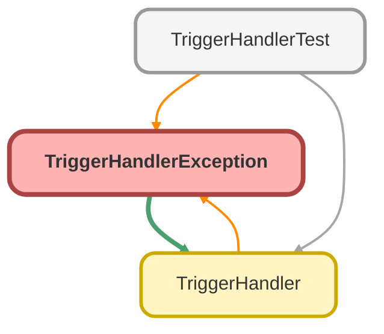

---
hide:
  - path
---

## Class Diagram



<!-- Apex description -->

## Apex Code

```java
public class TriggerHandlerException extends Exception {}
```

# TriggerHandlerException Class

**Inheritance**

Exception