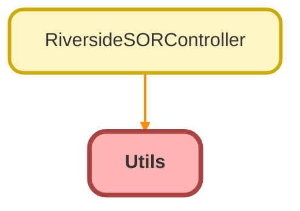

---
hide:
  - path
---

# Utils Class

## Class Diagram



<!-- Apex description -->

## Apex Code

```java
public with sharing class Utils {

    @AuraEnabled
    public static Boolean isSandbox() {
        //customer user compatible
        return system.URL.getOrgDomainUrl().toString().contains('.sandbox.');
    }

    public static Boolean validateAdminUser() {
        Boolean isAdmin = false;
        User currentUser = [
            SELECT Id, Profile.Name
            FROM User
            WHERE Id =: UserInfo.getUserId()
        ];
        if (currentUser.Profile.Name == 'System Administrator') {
            isAdmin = true;
        }
        return isAdmin;
    }

}

```

## Methods
### `isSandbox()`

`AURAENABLED`

#### Signature
```apex
public static Boolean isSandbox()
```

#### Return Type
**Boolean**

---

### `validateAdminUser()`

#### Signature
```apex
public static Boolean validateAdminUser()
```

#### Return Type
**Boolean**