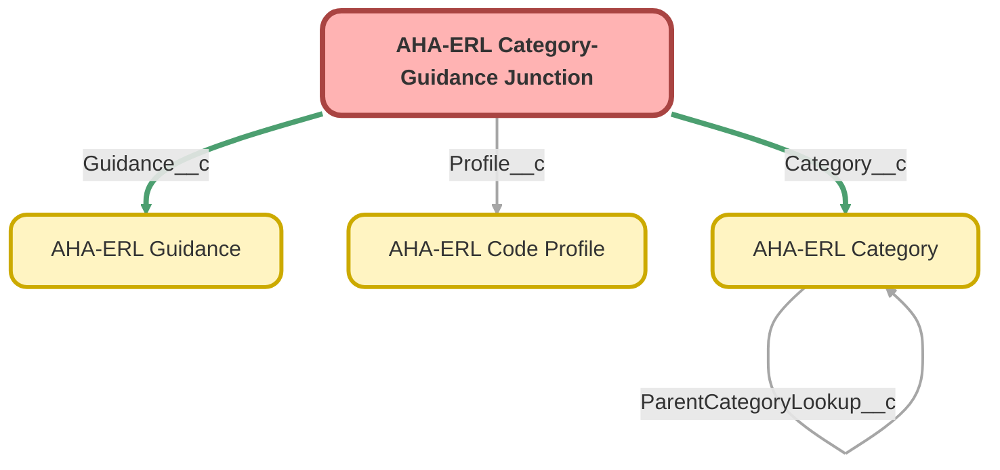

---
hide:
  - path
---

<!-- This file is auto-generated. if you do not want it to be overwritten, set TRUE in the line below -->
<!-- DO_NOT_OVERWRITE_DOC=FALSE -->

## Schema

<!-- Object description -->

## Fields

| Name | Label | Type | Description |
| :-------- | :---- | :--: | :---------- | 
| Category__c | Category | MasterDetail | undefined |
| ExternalIdentifier__c | External Identifier | Text | undefined |
| Guidance__c | Guidance | MasterDetail | undefined |
| Profile__c | Profile | Lookup | undefined |

## Related Apex Classes

| Apex Class | Type |
| :----      | :--: | 
| [AhaErlController](../apex/AhaErlController.md) | Lightning Controller |
| [AhaErlGuiCatJunctionHelper](../apex/AhaErlGuiCatJunctionHelper.md) | Class |
| [AhaErlGuiCatJunctionHelperTest](../apex/AhaErlGuiCatJunctionHelperTest.md) | Test |
| [AhaErlGuidanceCatJunctionTrigger](../apex/AhaErlGuidanceCatJunctionTrigger.md) | Trigger |

## Related Permission Sets

| Permission Set | User License |
| :----      | :--: | 
| [ERL_Full_Access](../permissionsets/ERL_Full_Access.md) | None |

_Documentation generated with [sfdx-hardis](https://sfdx-hardis.cloudity.com), by [Cloudity](https://www.cloudity.com/) & [friends](https://github.com/hardisgroupcom/sfdx-hardis/graphs/contributors)_
