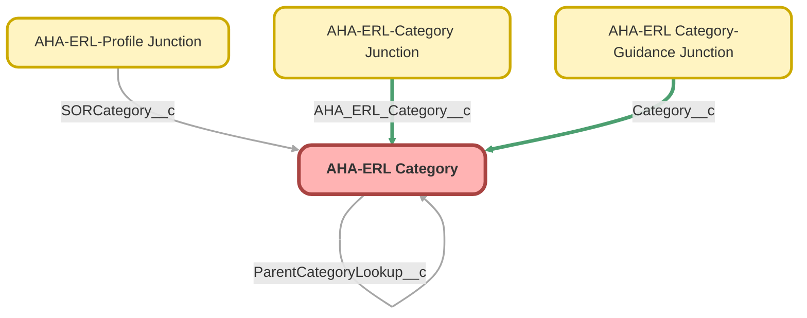

---
hide:
  - path
---

<!-- This file is auto-generated. if you do not want it to be overwritten, set TRUE in the line below -->
<!-- DO_NOT_OVERWRITE_DOC=FALSE -->

## Schema

<!-- Object description -->

## Fields

| Name | Label | Type | Description |
| :-------- | :---- | :--: | :---------- | 
| Category__c | Category | Picklist | undefined |
| EditModeLabel__c | Edit Mode Label | Text | undefined |
| ExternalIdentifier__c | External Identifier | Text | undefined |
| Full_Category__c | Full Category | Text | undefined |
| Full_Category_Layout__c | Full Category (Layout) | Text | undefined |
| FullLabel__c | Full Label | Text | undefined |
| Guided__c | Guided | Checkbox | undefined |
| HasParent__c | Has Parent | Checkbox | undefined |
| ImageFileText__c | Image File | Text | The location of the image file in the SOR Picker Static Resource zip file. |
| ItemPicklist__c | Item | Picklist | undefined |
| Label__c | Label | Text | The label to appear on the Category/Item/List |
| Layout_Left__c | Layout Left | Text | undefined |
| Layout_Top__c | Layout Top | Text | undefined |
| ParentCategoryLookup__c | Parent Category | Lookup | undefined |
| ParentExternalIdentifier__c | Parent External Identifier | Text | undefined |
| RecordTypeName__c | Record Type Name | Text | undefined |
| RedirectToLookup__c | Redirect To | Lookup | undefined |
| Reporting__c | Reporting | Checkbox | undefined |
| Sub_Item__c | Sub-Item | Picklist | undefined |
| SubCategoryPicklist__c | Sub-Category | Picklist | undefined |

## Related Flows

| Object | Name | Type | Description | Status |
| :----  | :-------- | :--: | :---------- | :----- |
| 💻 | [AHA_ERL_Example_Flow](../flows/AHA_ERL_Example_Flow.md) [🕒](../flows/AHA_ERL_Example_Flow-history.md) |  Screen Flow | <!-- --> | Draft |

## Related Apex Classes

| Apex Class | Type |
| :----      | :--: | 
| [AhaErlCategoryJunctionHelperTest](../apex/AhaErlCategoryJunctionHelperTest.md) | Test |
| [AhaErlController](../apex/AhaErlController.md) | Lightning Controller |
| [AhaErlGuiCatJunctionHelperTest](../apex/AhaErlGuiCatJunctionHelperTest.md) | Test |
| [AhaErlHierarchyController](../apex/AhaErlHierarchyController.md) | Lightning Controller |
| [AhaErlHierarchyControllerTest](../apex/AhaErlHierarchyControllerTest.md) | Test |
| [AhaErlSeedDataController](../apex/AhaErlSeedDataController.md) | Lightning Controller |
| [AhaErlSeedDataControllerTest](../apex/AhaErlSeedDataControllerTest.md) | Test |

## Related Lightning Pages

| Lightning Page | Type |
| :----      | :--: | 
| [AHA_ERL_CategoryButtonLRP](../pages/AHA_ERL_CategoryButtonLRP.md) |  Record Page |
| [AHA_ERL_Category_Item_List_LRP](../pages/AHA_ERL_Category_Item_List_LRP.md) |  Record Page |
| [AHA_ERL_Category_Record_Page](../pages/AHA_ERL_Category_Record_Page.md) |  Record Page |

## Related Permission Sets

| Permission Set | User License |
| :----      | :--: | 
| [ERL_Full_Access](../permissionsets/ERL_Full_Access.md) | None |

_Documentation generated with [sfdx-hardis](https://sfdx-hardis.cloudity.com), by [Cloudity](https://www.cloudity.com/) & [friends](https://github.com/hardisgroupcom/sfdx-hardis/graphs/contributors)_
