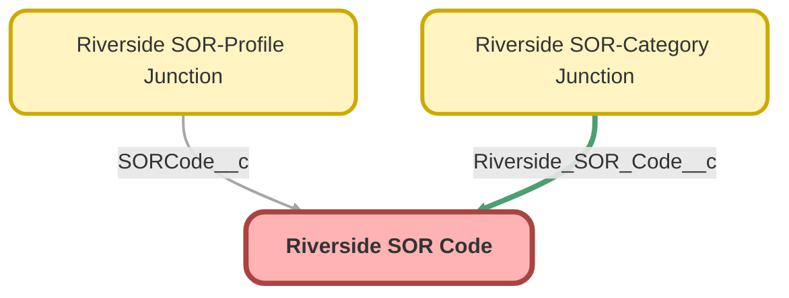

---
hide:
  - path
---

<!-- This file is auto-generated. if you do not want it to be overwritten, set TRUE in the line below -->
<!-- DO_NOT_OVERWRITE_DOC=FALSE -->

## Schema

<!-- Object description -->

## Fields

| Name | Label | Type | Description |
| :-------- | :---- | :--: | :---------- | 
| Category__c | Category | Text | undefined |
| CategoryPicklist__c | Category | Picklist | undefined |
| DefaultLocation__c | Default Location | Text | undefined |
| DefaultPriority__c | Default Priority | Text | undefined |
| DefaultQuantity__c | Default Quantity | Number | undefined |
| Message__c | Message | Html | Messages are used for Message Sor Code record types, this message will be displayed on the SOR selector instead of a selectable SOR. |
| SORCodeText__c | SOR Code | Text | undefined |
| SORDescriptionText__c | SOR Description | Text | undefined |
| SORFullDescriptionLongText__c | SOR Full Description | LongTextArea | undefined |
| SORHeadingText__c | SOR Heading | Text | undefined |
| SORRateCurrency__c | SOR Rate | Currency | undefined |
| SubCategory__c | Sub-Category | Text | undefined |
| SubCategoryPicklist__c | Sub-Category | Picklist | undefined |
| Trade__c | Trade | Text | undefined |

## Related Apex Classes

| Apex Class | Type |
| :----      | :--: | 
| [RiversideSORController](../apex/RiversideSORController.md) | Lightning Controller |
| [RiversideSORHierarchyController](../apex/RiversideSORHierarchyController.md) | Lightning Controller |
| [RiversideSORHierarchyControllerTest](../apex/RiversideSORHierarchyControllerTest.md) | Test |

## Related Lightning Pages

| Lightning Page | Type |
| :----      | :--: | 
| [Riverside_SOR_Code_Record_Page](../pages/Riverside_SOR_Code_Record_Page.md) |  Record Page |

## Related Permission Sets

| Permission Set | User License |
| :----      | :--: | 
| [ERL_Full_Access](../permissionsets/ERL_Full_Access.md) | None |

_Documentation generated with [sfdx-hardis](https://sfdx-hardis.cloudity.com), by [Cloudity](https://www.cloudity.com/) & [friends](https://github.com/hardisgroupcom/sfdx-hardis/graphs/contributors)_
